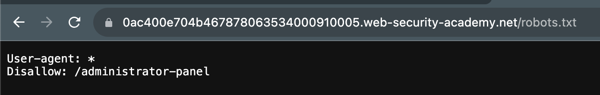
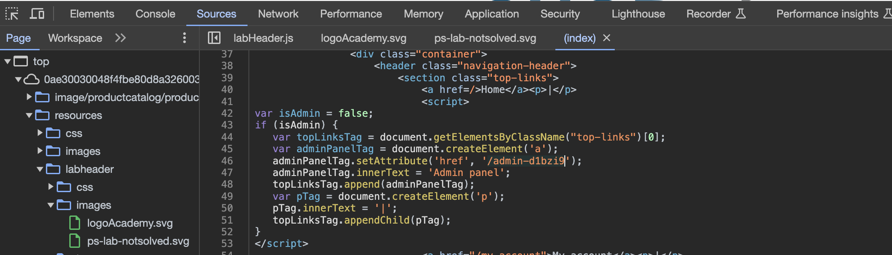

# Access Control

## Unprotected Functionality
Some websites expose sensitive functionality in the URL i.e., being able to access
- https://insecure-website.com/admin
- https://insecure-website.com/robots.txt

The administrative data may be in the robots.txt; There may be a wordlist to use
i.e., 

Some websites might try to obscure special url but it maybe the case its accesable from the javascript or web inspection
- https://insecure-website.com/administrator-panel-yb556

i.e., In the source files

Some access control is gated by a parameter i.e., 
- Cookies
- Hidden fields
- Preset query strings 
    - https://insecure-website.com/login/home.jsp?admin=true
    - https://insecure-website.com/login/home.jsp?role=1

Horizontal Privledge escaltion means gaining access to other users vsing Admin privledges which is vertical

A large note is information exposed in cookies, html or anywhere on the page. This information may be able to be used.