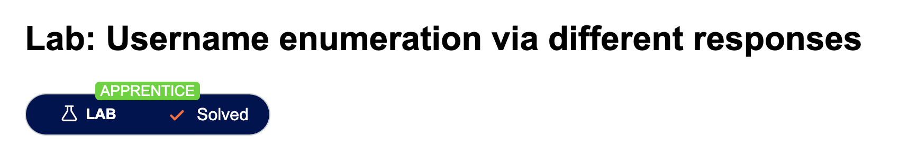

# Authentification
Authentification happens when the server attempts to answer the question:  
<b>'Is this user really who he says he is?'  </b>

The fist and foremost is to find a valid username. This can be done by intelligent guessing or checking the HTML responses if it contains information such as emails etc.,

However some companies use predicatable usernames such as lastname.firstname@companyname.com 

Other ways to find valid username:
- Registration form responses (i.e., this username is used!)
- Login attempts (diffrent message, sometimes not visible but shown in the HTML response!)
- Latency time for processing the request

Passwords generally require: 
- One number
- One uppercase
- One non alphanumerical character 
- \>= 8 characters

Its important to check the registration policy

However people are genrally lazy and will use passwords that a small variations from normal ones such as
Password!0, Password?0 etc

This enumeration can be done using a known password list and user name then utilizing something like Burp Suite Intruder

Solved 4 Dec 2023: User the commonpass and commonuser found user puppet with password soccer 

## Bypassing 2FA
Sometimes if we see login then 2FA then we have already entered into a "logged in stage" and often we can bypass other checks using just the login step. Changing the URL
