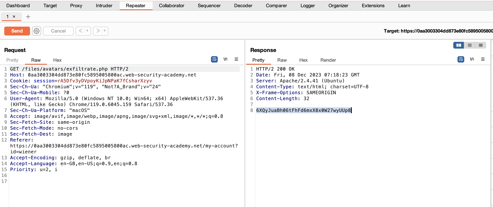
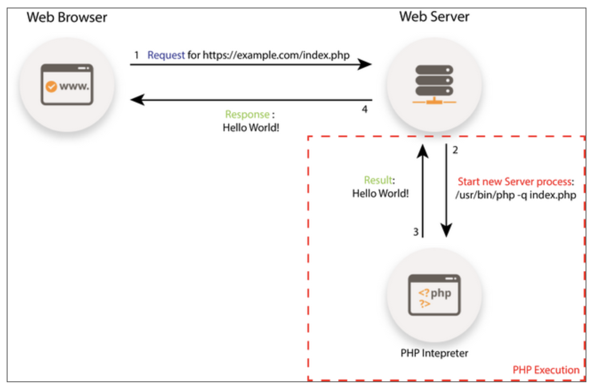

# [File Upload Vulnerabilities](https://portswigger.net/web-security/learning-paths/server-side-vulnerabilities-apprentice/file-upload-apprentice/file-upload/what-are-file-upload-vulnerabilities)

Uploading to the server without validating size, name, contents can carry risk for the server.

Due to the obvious risky nature of accepting user uploaded files developers will apply basic rules to prevent heinous objects, however these basic rules often miss points or can be bypassed.

e.g. Blacklist may forget some unknown extensions or fail to account for parsing errors.

> Definition: Webshell is a malicious script the attacker can use to execute code on the servers. Done by sending HTTP request to the right endpoint

A web shell one liner such as  
`<?php echo file_get_contents('/path/to/target/file'); ?>` 
can be used to exfiltrate any contents on the server
or a more versitile one 
> \<?php echo system($_GET['command']); ?>

gets evoked by sending this request

```
GET /example/exploit.php?command=id HTTP/1.1
```

## [Lab Simple Exfiltrate](https://portswigger.net/web-security/learning-paths/server-side-vulnerabilities-apprentice/file-upload-apprentice/file-upload/lab-file-upload-remote-code-execution-via-web-shell-upload#)

In this lab we see that we can upload through upload profile a php script, we choose to upload the exfiltrate.php

Upon loading the page we can see in the burp suite the script was ran when trying to retrieve the avater image and we get our result.

This was ran again in the repeater to observe the ouput again


Sucess!

## Flawed Upload Vulnerability 
Often as part of submitting forms websites take in the text input with the content type `application/x-www-form-url-encoded`  but with larger things such as image file or pdf the content type of `multipart/form-data` is preferred.

[See submitted Content type and Content dispositions](https://portswigger.net/web-security/learning-paths/server-side-vulnerabilities-apprentice/file-upload-apprentice/file-upload/flawed-file-type-validation-9y92)

Flaws exist when the server only checks that the content type is correct however does not check the actual contents. This can be bypassed by using <b> Burp Repeater </b>

I.e., User contrallable parameters (which can be almost everything that is submitted) cannot be trusted!

## [Lab minimum perssions](https://portswigger.net/web-security/learning-paths/server-side-vulnerabilities-apprentice/file-upload-apprentice/file-upload/lab-file-upload-web-shell-upload-via-content-type-restriction-bypass#)

In this lab there is a upload that only checks the content type but this can be bypassed by Burp Suite. After sending the valid jpg, we use that POST and modify some parameters to send the exfiltration.php. Note, this operates under the premise that 
> calling the GET /path/to/.php also runs the php file!

This assumes:
- A php interpeter is installed on the server
- When a .php file is requested the php interpeter executes the code in the php file then sends the static result to the requester


https://www.fastcomet.com/tutorials/php-executions-optimization/how-it-works#:

After modifying the GET we can get the code for carlos
success!