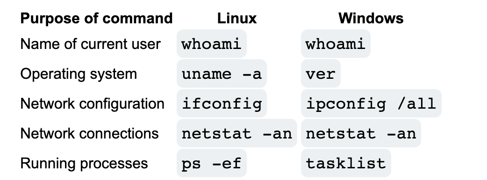

# [OS Injection](https://portswigger.net/web-security/learning-paths/server-side-vulnerabilities-apprentice/os-command-injection-apprentice/os-command-injection/what-is-os-command-injection)

> OS Injection is also known as Shell Injection

Some usefull commands are the following 

Sometimes websites utilize shell commands implicitly from api calls.. this can be a problem because attackers and input anything such as `& whoami`

## [Lab simple os injection](https://portswigger.net/web-security/learning-paths/server-side-vulnerabilities-apprentice/os-command-injection-apprentice/os-command-injection/lab-simple#)
In this lab we can modify the request to be 
> 1 && whoami && echo

this forms a valid command and gets the result who the user is

