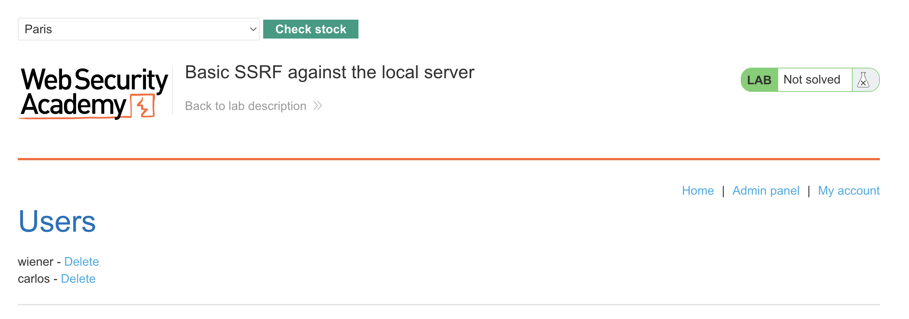
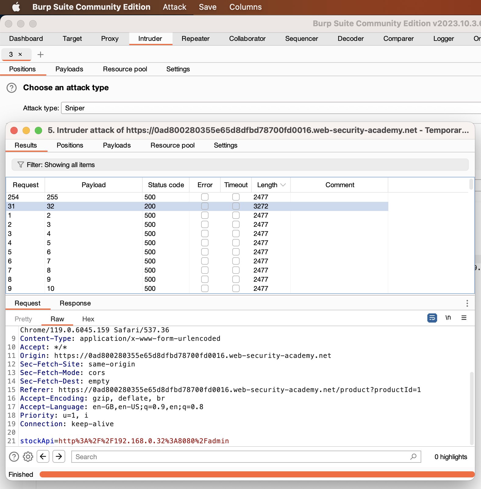
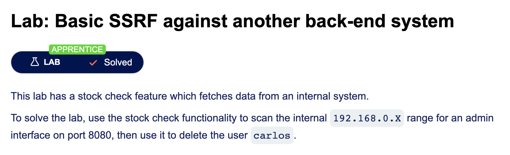

# Server Side Request Forgery

A server side request forgery utilizes api calls made from the application to the server to access unauthorized resources.

For example the attacker can modify a POST command and uses the localhost or 127.0.0.1 address to "masquarade" as the server
```
POST /product/stock HTTP/1.0
Content-Type: application/x-www-form-urlencoded
Content-Length: 118

stockApi=http://stock.weliketoshop.net:8080/product/stock/check%3FproductId%3D6%26storeId%3D1
```
change into:
```
POST /product/stock HTTP/1.0
Content-Type: application/x-www-form-urlencoded
Content-Length: 118

stockApi=http://localhost/admin
```

The idea of SSRF is to bypass authorization i.e., to access resources that are outside of our authorization. The above may achieve this because:
- The acess check may be done on the front end not on the local server
- Administrators mayuse "shortcuts" for ease of programming etc

Often look for API calls done by the server and attempt to find access. This one is done by editing the stockApi call to http://localhost/admin


One we get the path to delete a user in the api call we can utilize that again with the localhost. We submit that URL to the api call to complete the SSRF

> Non-routable IP Address = IP addresses used in a private network

Often if we know the range of IP's used by the application and backend then we can use the api call to scan a range of IP's using the intruder functino in burp suite

## [Lab: SSRF against backend system](https://portswigger.net/web-security/learning-paths/server-side-vulnerabilities-apprentice/ssrf-apprentice/ssrf/lab-basic-ssrf-against-backend-system)

We are given the basic premise there is a vulnerable IP range which can access the backend. This one we can utilize the intruder tab in burp suite to iterate across a range of values and test the one that works for 192.168.0.x for values 0 .. 255

In the intruder tab set the list to Numbers and set the range from 0 to 255 then start the `sniper` attack. After some time..

Found 32! which gives a different response than the others 

Now we know the Non-routable IP address to access the backend we can use this similar to `localhost` and send the malicious request!

thus we can again send the GET request that is used to access the admin panal to delete from the admin by the server

>http://192.168.0.32:8080/admin/delete?username=carlos

Completed: 