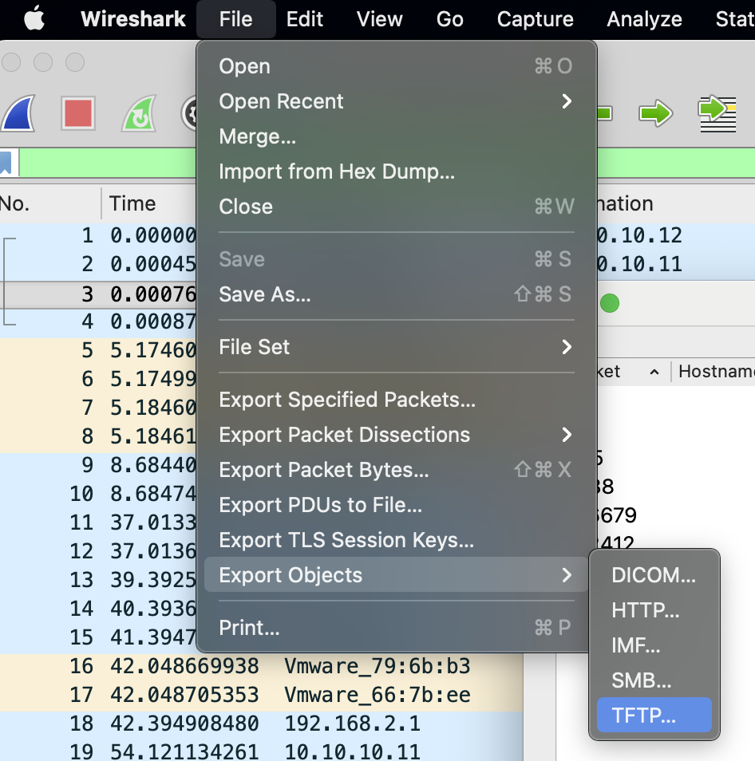
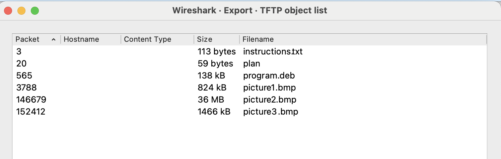
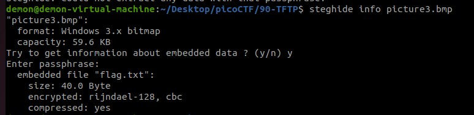

# [Trivial Flag Transfer Protocol](https://play.picoctf.org/practice/challenge/103?page=4) 

We are given a fairly large file tftp.pcapng which upon a quick google search is a wireshark file

## Analsis of the tftp.pcapng is Wireshark
The title is a play on of the Trivial File Transfer Protocol, we know that the protocol:
- Has no built in encryption or authentification

## Using Wireshark
- Opening wireshark we can observe that there is alot of TFTP exchanges. The objects can be exported using an inbuilt exports function
 
 - This displays a screen of options export all of them
 

## Analysing the files
Several files are obtained. A few pictures, illegible instruction and a program.deb file.
- Instruction Contents: GSGCQBRFAGRAPELCGBHEGENSSVPFBJRZHFGQVFTHVFRBHESYNTGENAFSRE.SVTHERBHGNJNLGBUVQRGURSYNTNAQVJVYYPURPXONPXSBEGURCYNA
- Plan Contents: 
VHFRQGURCEBTENZNAQUVQVGJVGU-QHRQVYVTRAPR.PURPXBHGGURCUBGBF

- program.deb this can be extracted using `ar -x path/to/deb/file.deb` on MAC

### Further analysis
- MD5Sums could be checked with each repo to notice and changes
- Steghide program run and use on the file
- plan probably is the initlization vetor or passphrase

### MAC related issues
- running the command `file stegohide` reveals an ELF 64-bit executable hence this won't be able to run on MACOS. Need to recompile from the [source code](https://github.com/StefanoDeVuono/steghide)
- See [this thread](https://gist.github.com/cedriczirtacic/f6e4c200a91dbf4840dde15fda35eff9?permalink_comment_id=2873590) comment on fixing the ./configure and make step
    - In summary (incase it goes down):
    - download [mcrypt](https://sourceforge.net/projects/mcrypt/files/latest/download) and [bhash](https://mhash.sourceforge.net/) from source forge
    - Extract and cd into the folder then run `./configure && make && make check && sudo make install`
    - Run ./configure again from steghide
    - Fix diff: src/Makefile.old: No such file or director by patching
    - Specific clang vs gcc error `configure:11234: gcc -V >&5
clang: error: argument to '-V' is missing (expected 1 value)` I encountered [similar to this](https://stackoverflow.com/questions/20132805/configure-error-with-mac-os-x-10-8-5-xcode-5-0-2-clang-error-argument-to-v)
        - Solution: Install gcc and use gcc not clang for gcc invokes
        - Getting [MacPorts](https://www.macports.org/install.php) to install gcc13 

### Running on Linux

Installation quick and easy not having to deal with compatibility issues while doing CTF is a lifesaver...

### Supicous Instructions .. Ceasar Cipher!?

The contents of instruction and plan look like a ceasar cipher. i.e., its alpha characters that sorta don't make sense could be shifted

We apply a 13 shift to plan and get this results

>TFTPDOESNTENCRYPTOURTRAFFICSOWEMUSTDISGUISEOURFLAGTRANSFER.FIGUREOUTAWAYTOHIDETHEFLAGANDIWILLCHECKBACKFORTHEPLAN

>IUSEDTHEPROGRAMANDHIDITWITH-DUEDILIGENCE.CHECKOUTTHEPHOTOS

Aha! They hide it -DUEDILIGENCE. this may be the passphrase..

Nice the first step of the puzzle

### Stegonography and the images and DUEDILIGENCE!

So we attenot to one by one use `stegohide info <filename>` to examine if we can extract anything from the suspicous images! Using the passphrase DUEDILIGENCE.. after some, due diligence we get a hit!

> picoCTF{h1dd3n_1n_pLa1n_51GHT_18375919}

