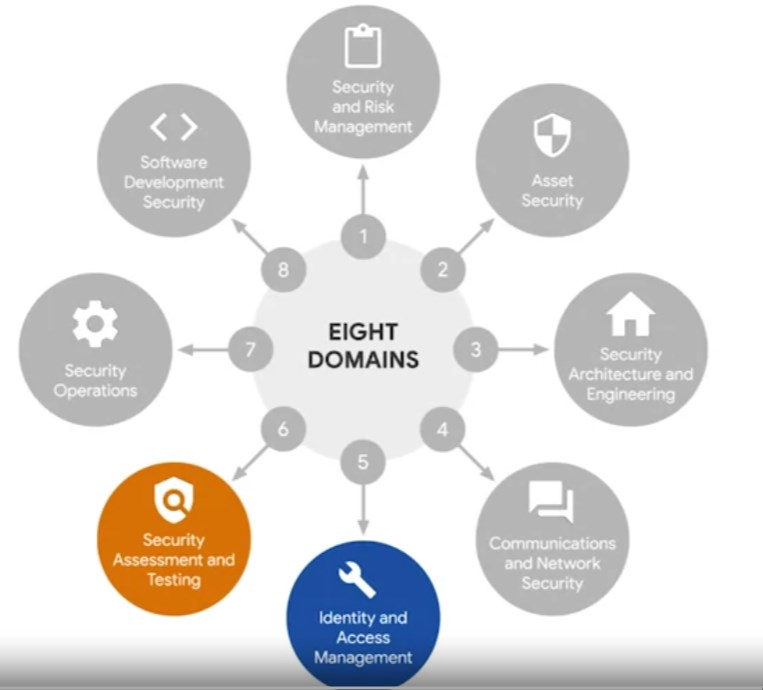
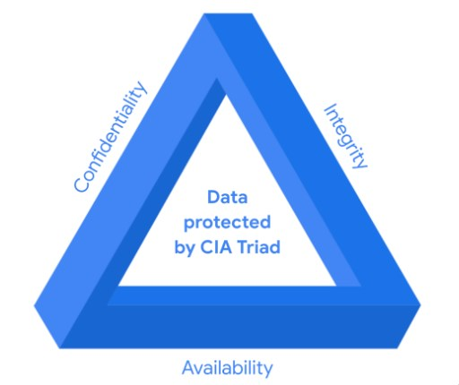
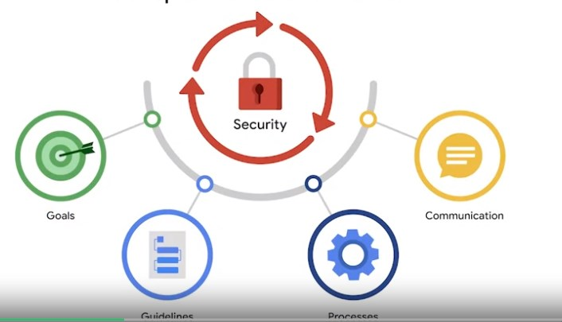
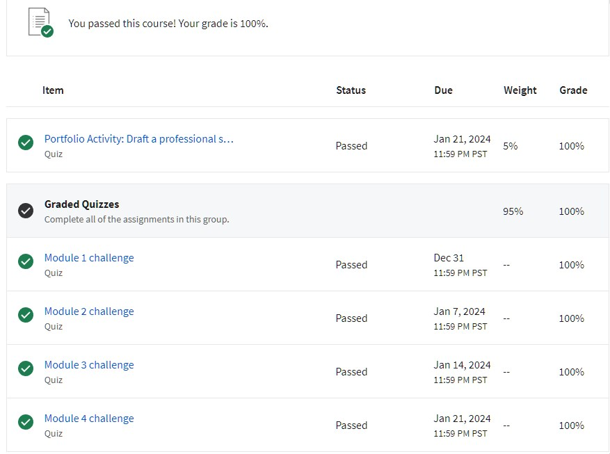

# Cybersecurity fundamentals

## Cybersecurity background
The first computer virus was the Brain. This was a infected floppy disk which was meant to see the proliferation of infecteed mediacal hardware. It would infect the computer and any subsequent devices which connected to that port.

The morris worm was the first wake-up call for the early internet society on the importance of internet security. 

## Domains of Security

## CIA Triad
- Confidentiality, Integrity and Availability
  

  Security frameworks help security professional comply with established laws and regulatations such as **GDPR (General Data Protection Regulation)**, **PCI DSS (Payment Card Industry Data Security Standard)** and **HIIPA (Health Insurance Portability and Accountability Act)**

## Security Frameworks 
They are guidelines that are developed to be complient with laws ans regulations. 
- They provide Goals, Guidelines, Processes and Communication and allows a "checklist" that someone can use to assess compentence

Ethics of security

## Security Tools

This type of art work is always used

Types of cybersecurity tools:
- SIEM (Security Information Event Management) keeps a log of security information
- Playbooks: Steps to follow when respondig to an incident or scenario for example a security breach has happaned. **Digital Forensics** should be done to preserve criminal activity in the **order of volitlity**. This tells you where data collection should begin by the rate of loss
- Packet sniffers or analyzers are tools used to analyze data travelling across locations

### Programming related
- Linux OS
- Python and SQL
- SIEM tools (crunk and splunk)

They automate and reduce time requred for task, but ehy may also be used to query information

> [OWASP Top 10 Web Vulnerabilities](https://owasp.org/www-project-top-ten/)

Proffesional statement

I am a motivated individual with a interest in software and cybersecurity. I have a internal goal of making a positive impact on society and bring a cheerful atmosphere to wherever I go. I am focusing on Security architecture and engineering, Security assesment and testing and software development security

[1] All images are sourced from the Google CyberSecurity Professional Course

