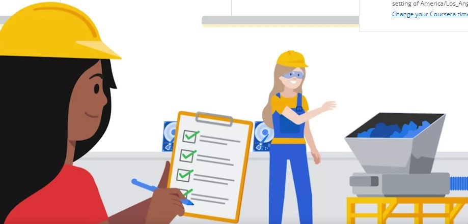
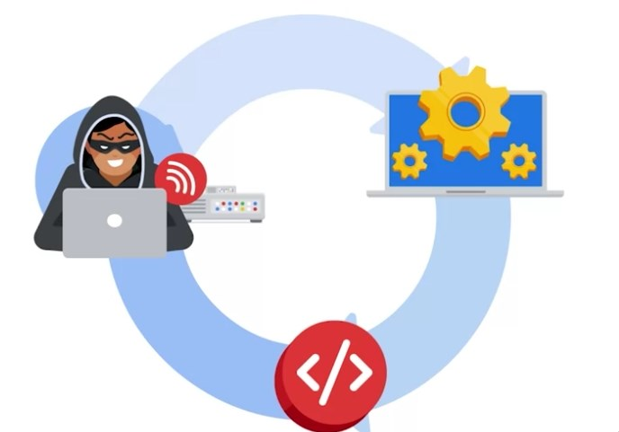
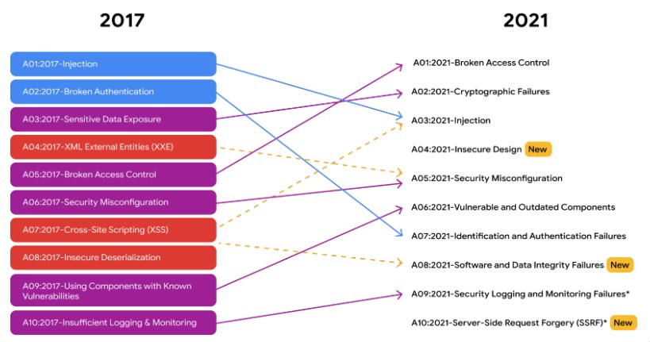
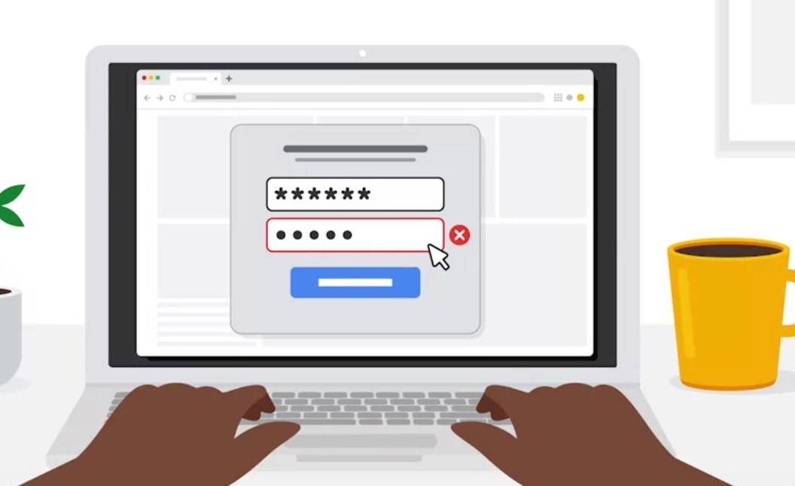

# [Managing Security Risks](https://www.coursera.org/learn/manage-security-risks/)

CISSP
- Security and Risk Management:
    - Laws and guidelines. Defining them and following legal regulations
    - Risk mitigation: reduce afteraffects of a breach by using proper risk manament
    - Business continuity is held by having risk handling procedure 9Risk disaster recorvery plan)
- Assets
  - Handling PII or SPII with proper protection
  - Procedure of storing, maintaining, retaining and destroying data
  - 
- Security Architecture and engineering
    - Focus on otmizing data security by using effecting tools and systems to protect
    - Shared responsibility (everyone takes an active role to reduce cybersecurity)
- Communication and network
    - Ensuring secure networks, clouds, wifi, hotspots etc.,
    -   Limiting access of wifi in public places to avoid leaking sensitive information on company devices by geofencing
    -   
- Identify and acess management
  - Limit user access to what the user needs
  - i.e., Users should each individualy have a username-accesscard
  - IAM: **Identity, Authentification/Authorization/Accountablility and Management**
- Security Assement and testing
    - Pentesting, security audits
    - Examining organization goals and objectives
    - Collect information
    - 
- Security Operations
  - Heightened sence of urgence. Mitigating attack and neutralization. Then collection of forensic evidence; to determine how, why and when did the breach occur
  - 
- Software development security
   Utilize secure software processes to code software
  - Secure design review during design stage
  - Secure implementation frameworks
  - Penetration testing
  - 

## Risks and Vulnerabilitys
1. Oudated firewalls
2. People educating in phishing/social engineering
3. Software vulnerbilities
4. Third part vulnerabilities

The ways to manage risk are:
- Avoidance
- Acceptance
- Mitigance and
- Transference

OWASP vulnerbilities

## NIST Risk Management Framework

- Prepare :  Activity that are nessary to identify and analyse risk before an indcident occurs
- Catergorize: Use to develop risk management processes and task (in regards to C.I.A. 
- Select : Choose, capture and customize documents i.e., update the playbook documentation
- Implementation :  Implement security controls to follow frameworks or inreaction to change in environment, i.e., employees frequencnly requiring password updates we may implement a diffrent password schema to reduce the frequency of password updates (increase security of pw)
- 
- Assess : Take the time and see if implemented procedures are meeting organizational requirements. Identify weaknesses 
- Authorize : Being accountable to security and privacy risks. Generating reports, developing plans of actions and establishing milestones
- Monitor : How systems are operating. Mainting the current systems by knowing how the systems support the current organizational roles
  