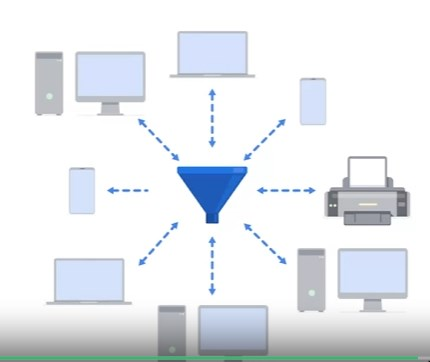
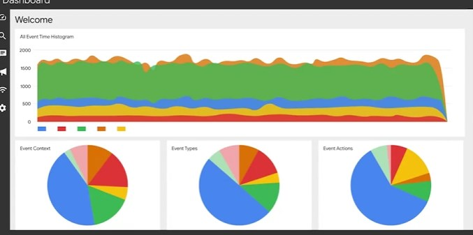

# [Security Information and Event Management](https://www.coursera.org/learn/manage-security-risks/lecture/ve2c9/logs-and-siem-tools)

SIEM tools collect and organize mutlitudes of security information from different tools into a single location.

SIEM dashboards are similar to antimalware dashboards, they can provide a comprehensive summary of data such as, type of vulnerability, time, source etc.

They may also contain metrics such as event context, event types and actions

> Security Ochestration, Automation and Response is an suite of automated tools to respond to security incidents