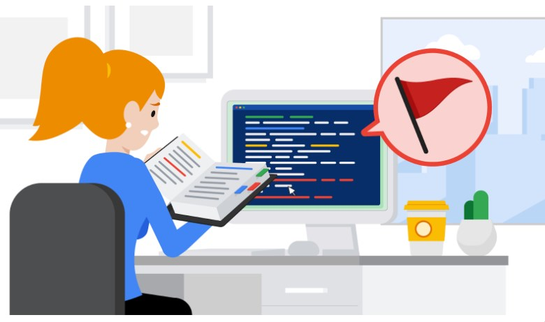

# Playbooks

Is a manaul of scenarios and play-by-play actions to handle that scenario. It is a collection of guidelines. However it can also have a plethero of contextual information similar to a dictionary.

They are used in dire times and are there to improve effiecicny of response time.

There are multiple pahses:

Preperation > Detection > Containment > Analysis > Eradication and Recovery > Post Indicdent activity 

Playbooks are a living object that should be updated and revised often as new threats are encovered on the cybersecurity landscape. But also changes to laws and regulation as well.