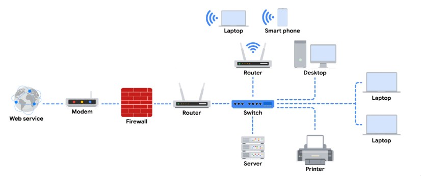
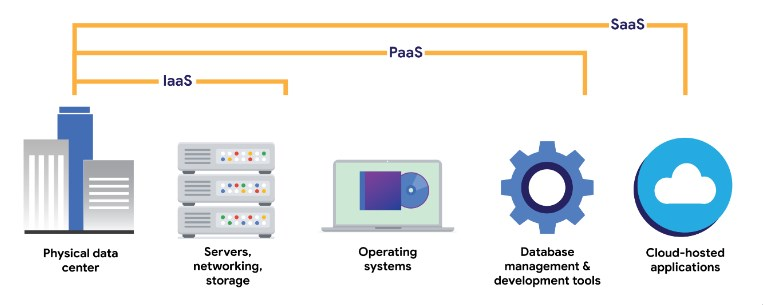
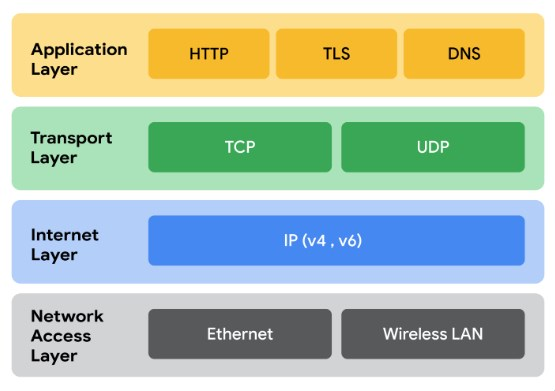

# Introduction to networks
Networks are complex. Many devices need to be interconnected in this present age. Phone connect to headphones to internet through bluetooth and wifi. Computers connect to other computers and so on..

As we transition into greater techonological ages, things such as providing infrastructure and platforms are being abstracted away and these form services such as IaaS and PaaS, with the topmost being SaaS that focuses on functionality.

These are cloud service providers

## TCP/IP Model

The internet utilizes the TCP/IP model to establish and communicate to other devices. It is important for devices that want to be interconnected to follow the standards set by the TCP/IP model.

Traditionaly we used the OSI model. The network access layer corresponded to the Physical and Datalink layer. This layer is responsible for creation of "Frames", these are sent to the Internet Layer where the data is encapsualted into the familiarly known IP packet. The Transport layer is responsible for delivery data between two systems.