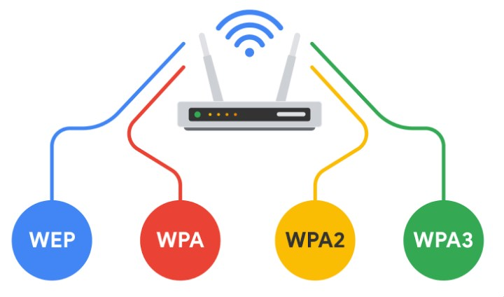
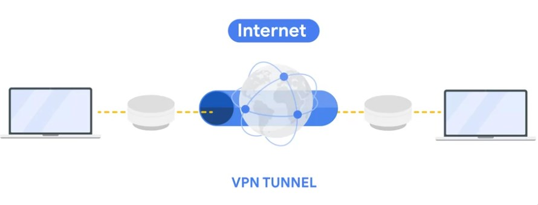
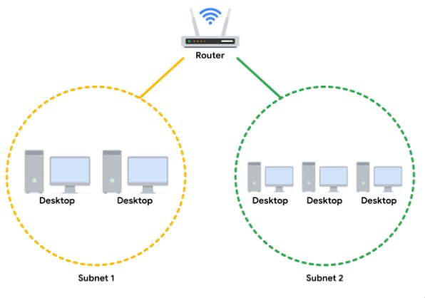
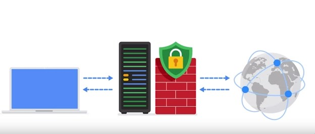

# [Network Operations](https://www.coursera.org/learn/networks-and-network-security/home/module/2)

Network protocols are divided into three main catergories:

Communication, Management and Security protocols.

Communications Protocol:
- TCP
- UDP
- HTTP (port 80)
- RDP Remote desktop protocol port 3389
- Telnet (port 23) 
- SSH (port 22)

Management:
- SNMP
- DNS (port 53)
- DHCP (server udp port 67 client udp port 68)

Security:
- HTTPS (port 443)
- SFTP

and much more.

## Wireless protocols
There are many protocols. WEP is the oldest and least secure whilst newer version add more layers of security.

## VPN and Cryptographic channel
VPN adds additional security to internet traffic and helps defend against man in the middle attacks

Security zones are important to establish seperation within a network, think of it like walls in a house. Security Zones comprises of subnets, VLANs and DMZ.

Security Zones are largly classified into Uncontrolled Zones and Controlled Zones. The Uncontrolled Zones refer to the wide web whilst the Controlled Zones refer to networks within your domain (routers control). In the Controlled Zones we have your subnets and VLANZ. Restricted Zones is a zone within the controlled zone which contains all your private data

## Proxy Servers
A proxy server sits in the middle of internet traffic to the organization servers i.e,. access website. The Proxy server acts as a filter/control a bodygaurd to analyze the data or data leaving out. It also hides the companies private IP address. Proxy Servers utilize **Network Address Translation NAT** to srever as a barrier between  parties

- Forward Proxy Server : In leaving out checks no data is being exfiltrated
- Reverse Proxy Server " Out coming in checks spam or phising messages etc.,