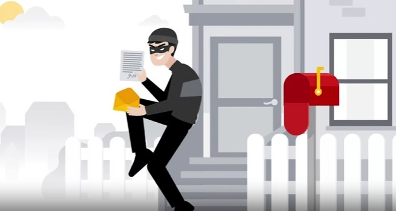
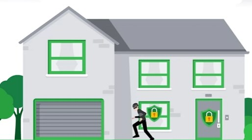
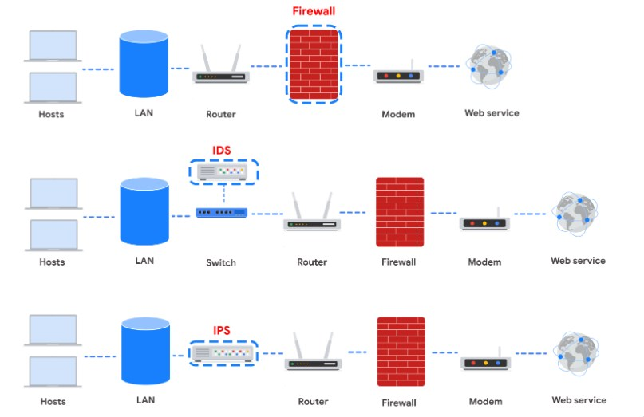

# Network Intrusion

Networks are every around us in the modern age. As such they are ripe targets for attackers. In this section we discuss network intrution tactics and identification.

## Analyze Network Layer report
In this lab we observe the inability of DNS resolution by the domain server.

Write Up:

The UDP protocl reveals that a DNS resolution was unsucessfull for yummyrecipesforme.com on 13h:24m:32s 

This is based on the results that show the ICMP checo reply returned the error: UDP port 53 unreachable which is the common DNS port number.

The most likely cause of this issue is the DNS being currently incapacitated. The source of the incapcitation is unknown without further analysis however it can fall into catergories of serverity the first being a DoS attack from another actor, whilst the lower being a misconfiguration issue on the DNS i.e., by accidently blocking of port 53.

The incident occured at 1:24pm and the IT team had been alerted by serveral customer complaints of the inability to access the website.

The IT team will follow up by investigating the situation at the DNS including network traffic analysis. 

The investigation was done using tcpdump for packet sniffing and analyze the traffic.

We have found that the server was experiencing a DDoS attack originating mainly from within the country. We have currenly stifled their attack efforts and are following up with the authorities.

## Packet Sniffing
Packet sniffing is like opening someone elses mail! It can be active or passive.

- Passive would be reading the packets and analyzing. 
- Active would be crafting and injecting packets
VPNs can be used to preven packet sniffing

In the incident response we the log shows a flood of SYN request from an unknow IP address 203.0.113.0 to the server 192.0.2.1.
Initialy the attack starts at 3.39s with a valid SYN, SYN-ACK, ACK sequence however the attacker proceedes to inundate the server with SYN messages.

We also observe legitamate users timing out. Thus this explains the server is undergoing a SYN Flood attack.

The result of this flood is a denial of service to the legitamate users.

### Types of attacks

1. IPSpoofing is the act of sniffing out a authorized users IP address to gain access to a network
2. Replay attack is to repeat a captured packet to the server
3. Smurfing is a combination of IPspoofing and DoS to flood the server with request after gaining a authorized users IP address

## Security Hardening

Security hardening is the act of making it harder for malicous actors to exert their influence. This may be software hardening such as applying latest patches, physical hardening such as security cameras or configuration hardening such as blocking vulnerable ports.

Security Report:
The website was comprismised involving the HTTP protocol and DNS protocol. Customers reported of a malicious file being automatically downloaded when they connected to the website xfood.com. The file after being downloaded would redirect the user to yfood.com where all the food recipes where available for free and also downloaded a bitcoin miner on their PC. IT team confirmed these findings on a Sandbox environment. 

The IT team found that additional javascript was added to the legitmate webpage. This instructed the connecting client to download a file which changes the DNS address resolution of xfood.com to yfood.com. The actor accessed the administrator panal and made these changes. Before accessing the admin panal multiple failed password login attemps where  observed indicative of a Brute force attack.
The reccomended remidiation is to update the current password policy to require harder to guess passwords.

### Network hardening
- Port filterning, Network access priveledges, encryption, firewall rule maintenece

Lab Types of network hardening to apply. We know that the hypothetical company shares passwords, has a defualt password for administrator, doenst filter data coming in and out and also doesnt use MFA.

The network hardening suggestion will be:
1. Update Password Policies - require the password for all users including administrator be sufficient complex and non-brute forcable within a short time frame. Discorage password sharing
2. Implement a next generation firewall/Update firewall maintence to monitor malicous traffic coming inbound and also preventing data from being leaked outbound as well as preventing any non-verifyable servers being connected.
3. Implement MFA to protect against brute force attacks requiring the login request to be accompanied by another source of authentification.

## Cloud Hardening
Cloud services are accesible via the internet owing to their increased assesibility they also create a large target on them for attackers.

## NIST incident report
Summary: The network had recently experienced a flood of ICMP packets from a "authorized" IP address this came through from an unconfigured firewall resuling in a DDoS.

Indentify: It was identified that the DDoS resulted from unconfigured firewall. 

Protect: The firewall will need to have an updated configuration

Detect: To detect future incidents we will need to put inplace an IDS to detect itrutions.

Respond: Next response action is to check the settings on the devices and to isolate the network

Recover: Back to normal thigns