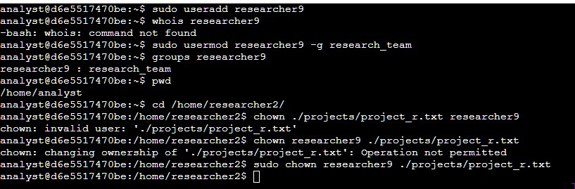
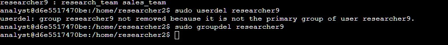
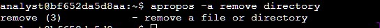

# Permissions and commands

User groups. People can be added to groups to gain a plethera of defined group permissions. This makes it easier for the security admin to manage a large group of users privelidges.

Adding, deleting people from the systems utilizes the following commands
`useradd`, `userdel`,

Adding a person would be `sudo useradd <usernamee>`

Deleting a person would be `sudo userdel <username>`

As we cam see we need **root priveledges** to add or delete a user 

The sudo command is conly available if the usr has is given access in a configuration file called "sudoers file"

## How to add and delete users from a group
The useradd can be passed with the `-g` or `-G` flag the first one sets the users default group also called the primary group, whilst the capital G adds the user to additional groups, also known as secondary groups.

This can also be done by using `usermod` with the same rules as in `useradd` for adding to groups, Additional `usermod` can be used to:
- -d: Change users home director
- -l: Change users login name
- -L: Lock the users account to preven login

## Changing owner ship of a file
Using the `chown` we can change the user or group ownership of files and directories. When we want to change the group ownership we must use a colon :
`sudo chown :security access.txt`. The colon is used to specify a group.

Lab Adding a user and changing the ownership of a file to them

> to view all groups go to /etc/groups configuration file

Deleting the user use userdel. Also note the return since Linux automatically creates a group containing just the user when a new user is added, we must also clean up and remove that group

## Getting Help in Linux
The [stack exchange community](https://unix.stackexchange.com/) for help

`man` and `apropos`

The man command gives manual data about a command. 
We can also quickly search man pages for a command. this by using the apropos command. i.e., `apropos -a change password` searches the man pages for commands that contain the desciption change and password

`whatis`

What is is a command to get a bite sized description of a command.

[Continue with sql](./sql/)