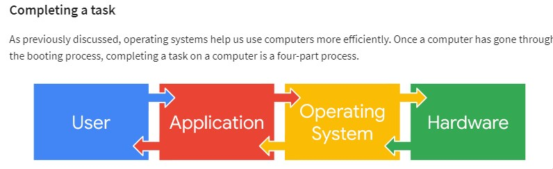
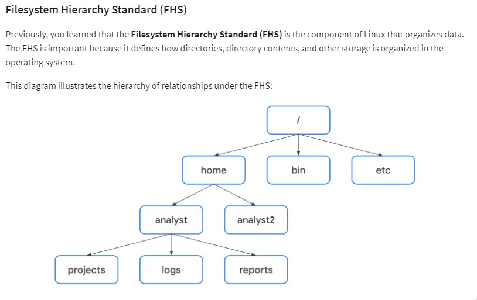

# Operating Systems and Linux

Operating systems are the bridge between the hardware and the software. They also have vulnerabilities such as

[Linux Related Vulnerabilities](https://ubuntu.com/security/cves)

[Microsoft Related Vunlerabilities](https://msrc.microsoft.com/update-guide/vulnerability)

Operating Systems often start with the BIOS or UEFI microchip activation. These contain the instruction to kickoff the computer. The last instruction from the BIOS and UEFI is the **bootloader** which boots the operating system



The OS also importantly acts as the conductor for resource, application and memory management.


## Linux components and Distrubutions
The Kernal is the most important part of the Linux operating system. It communicates with the hardware through drivers. It also manages resources and memory.

Due to its open source nature the Kernal has been modified for specific functionalities by the community. Some of these are:
- Debian (Ubuntu and Kali Linux)
- Red Hat (CentOS)
- Slackware (SUSE)

Each distrubution typically has modified kernal, packet manager system and utilities

### Packet Managers for installing applications

Since Ubuntu is the most commonly used distrubution and Kali is the most commonoly used for offensive security are both based of Debian, being familit with the APT (Advanced Package Tool) packet mangement system will be usefull.

Typically Debian packet files have `dpkg` or `.deb` extensions

Red hate (CentOS) usese the RPM or Red Hat Packet Manager. It uses Yellow dog Updater Modified (YUM)


## Linux Commands

expr evaluates the next expression as a maths expersion/function

The following can be run as a shell script with a single arugment which is `$1`
```
# Calculates the length of the argument
x=$1
sub=`expr length $x`

echo $sub
```

- Standart input is sent to the operating system
- Standard output is sent from the operating system

The operating system may show standard errors which is error messages returned by the OS through the shell


Additional useful commands:
- ls, man, pwd, cd, mv, rm, cat are common
- head txtfile.txt : shows fthe first 10 lines of a text file
- tail textfile.txt : shows the last 10 lines of a text file
- less textfile.txt : shows contents of text file within a page

## Linux File structure


The Standard FHS directories are 
- /home: Which is the home directory
- /bin: Binary and other executable files that the computer uses to run programs
- /etc: This directory stores system configuration files
- /tmp : temporary files, highly used by attackers
- /mnt : mount such as usb etc

* Use man `hier` to learn more about the FHS

## Finding files in Linux
Finding and filtering for specific information is essential for any users to locate files


#### `grep`
Grep find matches of the string provided in a file or output. 
Grep takes in a string and a file or stdin as arguments

#### `| piping` 
This sends stdout to stdin to another command
i.e., `ls /home/analyse/reports | grep users`
The stdout of the first command goes into the stdin of the second command

#### `find`
Find command searches for directories and files that meet a specific criteria. The criteria can be specific string in name, files size or last modified time.
Find takes a starting location and then flag what to find

## File Permision and ownerships

Owner, Group and Other

The owner is the user, each user can be a part of a group and the ones not apart of that group are called the others.

`drwxrwxrwx` 
- this code means d or - is directory or file
- the first group of three is the permisisons for current user
- the next group of three is permisions for the group
- the last is the permissions for the last owner type: other

Permissions can be added using `chmod` command


[Continue with permissions->](./permissions.md)