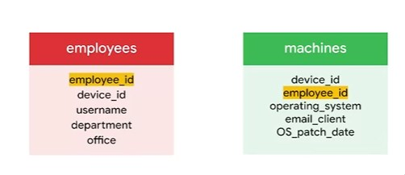
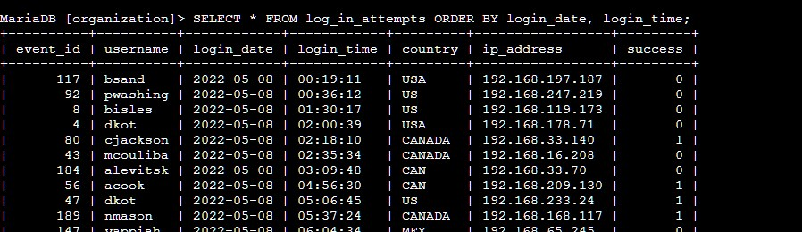
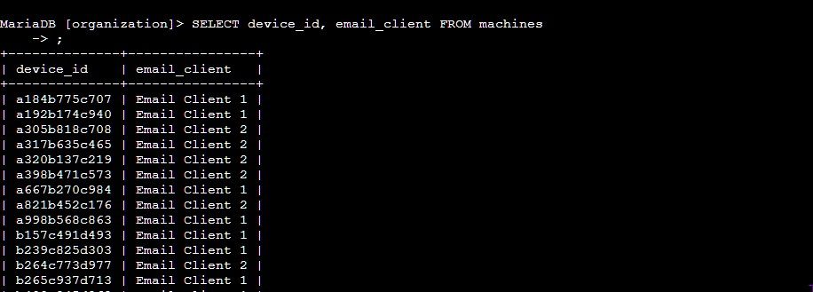
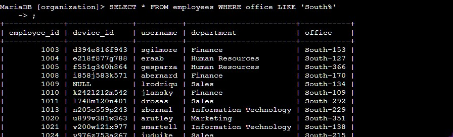
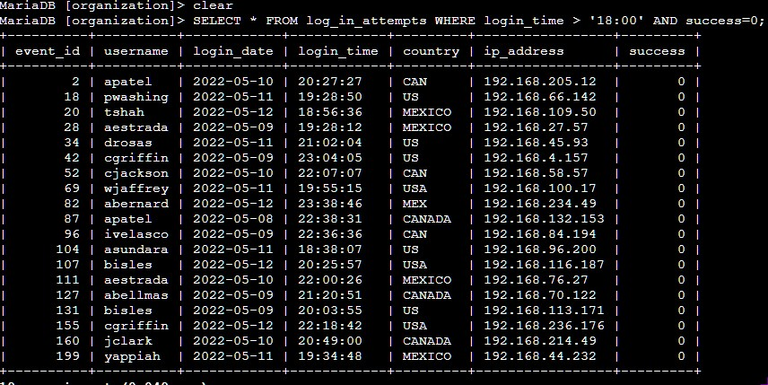
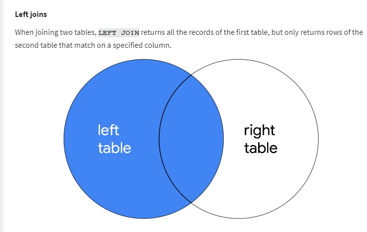
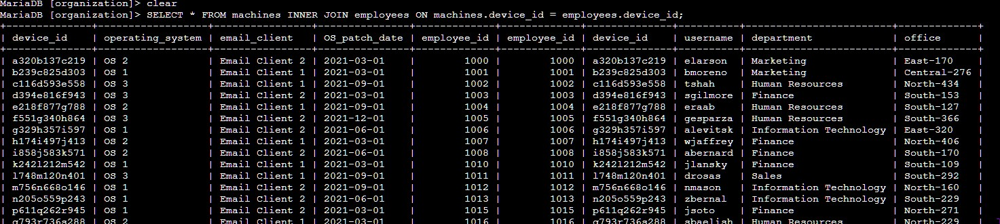

# Relational Databases 

SQL stands for Structured Query Language. Databases are just spreadsheet... no!
they facilitate multiple access, filtering and much more complex tasks


A SQL table is built ontop of Primary Keys
- Primary keys also allow us to uniquely identify rows in a table.
- There are no duplicate primary keys and they cannot be null

Within a table we use Foreign Keys to connect data to another table's keys.
- Foreign Key means Primary Key of another table



## Structured Query Langugae
Is a programming language used to query data in a datbase.
They are usefull in cybersecurity to quickly analyse data such as
- which PC's have not been patched
- when are PC's most often used
- type of activity/file downloaded on a PC etc


The following SQL queries a database (Maria) to view login times of users ordered by the earliest times



### SQL Filters

Filters are extremely important part of SQL. They allow us to narrow down data further to what we want. i.e., we want country to be only USA we can add `WHERE country = 'usa';`


We can further filter using the `%` which acts similar to a pattern match i.e., if we want names starting with J we would use `WHERE name LIKE 'J%'`

SQL wildcards:
- '%' match any number of characters after/before
- '_' match any single character in the position of the '_'

Lab utilizing the filters.

Where statement searching for employees


Filtering using the LIKE and '%' wildcard


### More SQL filters 
SQL data has three main data types: String, Date-Time and Numeric.

We can utilize additional symbols such as:
- \>
- <
- BETWEEN
- <> (not equal)
- <=
- =>

The following query checks failed login attempts after office hours


The following is a query to find login attempts that are not like the pattern

```
SELECT * FROM log_in_attempts WHERE NOT country LIKE 'MEX%';
```

### SQL Joins (and Unions)
SQL joining is important when we want to collate data from many tables. It does this by combining the data from two columns i.e., extending the rows (more fields in the row)

The first step of a Join is to identify the columns in the tables taht will connect the tables. This is typically a Primary key in one table and a foreign key in the other tables.

On the other hand Unions are used to extend the columns (more entries in the columes)


Types of joins:
- Inner Join :  SQL attemps to join rows which have a match in the specified columns. The result is a row with all the columns in both tables that have the matching values in the specified columns. NULL do not participate in the joins.
- Outer Joins: They comibine two tables together but they do not require a match in the column
  - Left Join returns all rows in the first table but only rows that match the specified column in the second table
  - Right Joins return all the rows from the second tables but only matching rows in the first table
  - Full outer joins return all rows on borh lwft and right tables



The following query does an inner join from two tables on the device_id column.
Notice how all the columns are returned from both tables which match the criteria.


## Continous learning SQL

SQL is quite the deep programming language. It can be used to do much much more. For example Aggregate functions are functions that perform an action over multiple data points.

Such as:
- COUNT : returns a single number represenging number of rows returned from a query
- AVG : returns a single number repesening the avg of numerical data
- SUM : returns the sum of numbers of a numberical data


