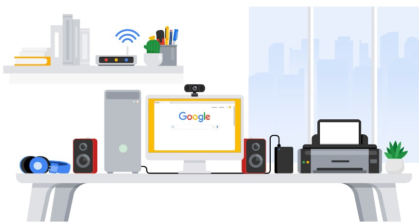

# Assets

Assets start by taking an inventory - what assets are there,
then a classification how important are they.

The following are a few assets around my personal space that connect to the network:

- Asset; Network; Access; Owner; Location; Notes; Sensitivity
- Router; Continous; ISP; On prem; 2.4ghz and 5.ghz; confidential
- Access Point; Continous; Homewoner; on prem; 2.4ghz and 5.ghz; Restricted
- Desktop; continous; owner ; on prem; ..

