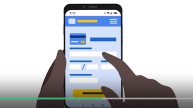
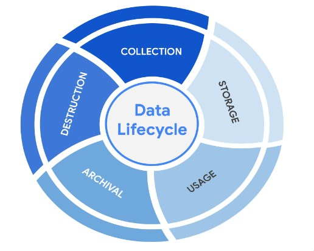
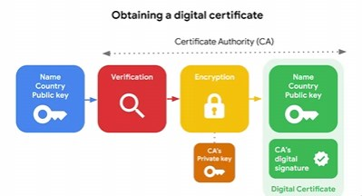
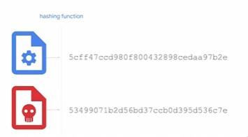
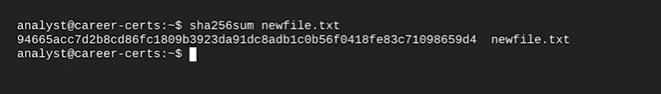
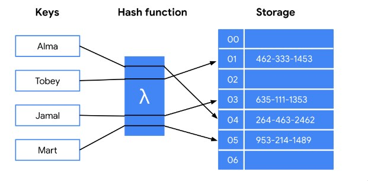
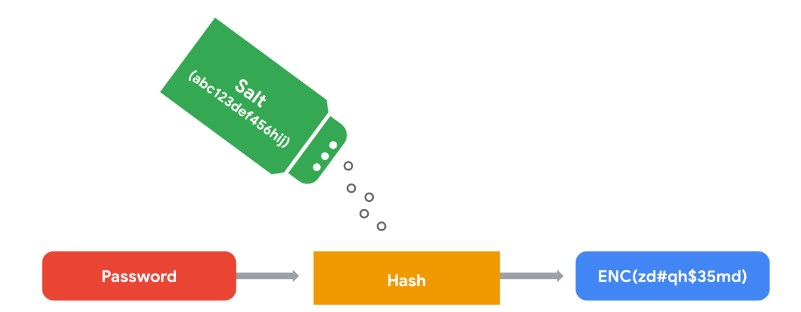
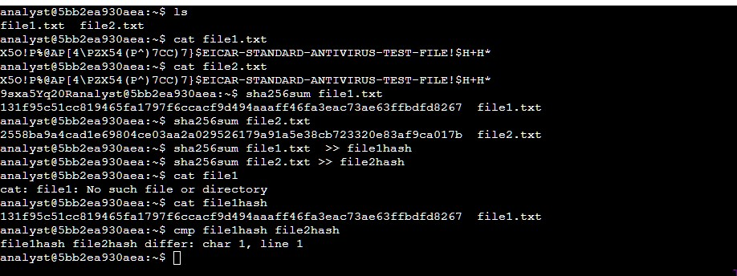
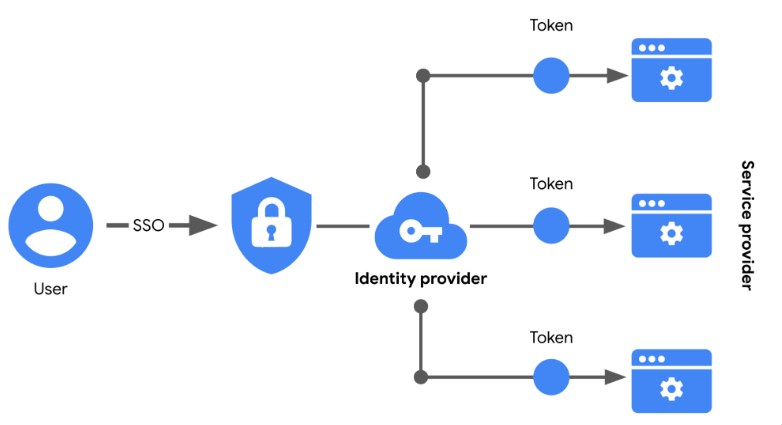

# Security Controls

Security Controls are methods of ensuring security. They are broadly catorized as:
1. Technical : Encryption, Authentification
2. Operational : Security awareness, day-to-day
3. Managerial : Policies, Standards and Procedures

An important princple is the Principle of Least Privelidges. This means only the person who needs access is given access.
1. Who needs the data
2. Who are they 
3. How much access do they need

Data Owner : Who can access, edit and destroy information  
Data Custodian : Anyone or Anything responsible for storage, tranport and handling of information

## Data Lifecycle

The Custodian, Owner and the steward (a group or person that maintaince data governance policies set the the organizetion) are all responsible for each stage of the data lifecycle.

- PII : Information that can locate or contact someone
- PHI: Relates to present or past medical history including physical or mental health
- SPII: Information that is sensitive like tax file number, bank details, login credientials.

### Information Privacy vs Security
Privacy refers to the protection of unauthorized data i.e., someones willingness of exposing data. Prevent data being used without consent.
- GDPR
- PCI DSS
- HIIPA

Security is the ability of keeping data safe and away from unauthorized entities.

Audit: A review of current matters
Assesment: A test

Data leak due to failure of least priveledgses
The access to the files containing the internal documents from the manager should've been restricted only to the people needing it.
NISP SP 800-53 AC-6 addresses how an orgnization can use least priveldges to protect
- Recomended to restrict access based on user role and audit frequently.

## Cryptography and Encryption

PKI - Public Key Infrastructure: Is a framework that secures the exchange of information online.

It uses asymmetric/symmetric encryption to secure information being exchanges. Then it also uses digital certifictes to verify the authenticity of the data. Two step processes

### Encryption Algorithms
- Symmetric Algorithms
  - Triple DES : Block cipher 192 bit keys limited to amount of data able to be encrypted
  - AES : most secure today large keys make it strong against brute force

- Asymmetric
  - RSA  : uses public private key for highly sensitive information
  - DSA (digital signature algorithm) used as a compliment to RSA

Generating keys can be done using **OpenSSL**. OpenSSL is just one option there are many, in the past it had a vulnerability called [heartbleed](https://en.wikipedia.org/wiki/Heartbleed)

Simple Ceasar cipher we can use the terminal to preform a shift

`tr "d-za-cD-ZA-C" "a-zA-Z"` The following specifies a shift to apply to characters

Further more the following command can be used to apply encryption/decryption 
`openssl aes-256-cbc -pbkdf2 -a -d -in Q1.encrypted -out Q1.recovered -k ettubrute`

The above command reverses the encryption of the files using aes-256-cbc a secure symmetric cipher. The -pbkdf2 options adds extra security to the key. Furthemore the password is specified by the `-k ettubrute`

**These can be proformed in the linux terminal.**

### Non-repudiation and hashing: Trusting the source using hashing.

Hashing allows us to determine the integrity of a file 9The accuracy and the authentificy of the information i.e., Non-repudiation)

Furthermore hashes are a quick way to determine if a file may be malicious by comparing it with a know hash table.

Linux can be used to generate a hash for any file using the following commands
`sha256sum newfile.txt`

One of the vulnerabilities a Hashing function such as MD5 can have is Hash Collisions.

A Hash Collision is when two inputs produce the same digest. Since hashes are used to determine authentification, attackers may still be able to modify the data and result in the same hash!!

Passwords should always be stored hashed in the database. However, passwords should be salted to prevent rainbow table attacks

Hashing files and finding the differences

The following hashes two files and compares the differences using the cmp function

## Access Controls
Authentification: Who are you, can we trust you?
- Passwords
- What you own
- Biometrics

Authorization: What can you access?
Accountablility: What are you do..

SSO and MFA.

Single Sign On can be a avenue for attack since the user need only login once inorder to get access to a multitude of resources.

### Authorization

HTTPS uses OAuth - API tokens to very access. basic auth used to be used but it was vulnerable

SessionID is a unique token that identifies a user whilst they remain in the session. The next is session cookies that websites use to validate a session and how long they should last.

However session cookies can be stolen and a user can be impersonated. This is called session hijacking.

OAuth uses a API token to verify access between user and service provider. This contain information such as identity and permisions.

User Provisioning is process of creating and maintaining a user's digital identity.

types of access controls
- MAC : only people on need to know basis used in law, miltary, gov agency
- DAC : DISCRETIONARY I.E., GOOGLE DRIVE SHARES
- RBAC : role based