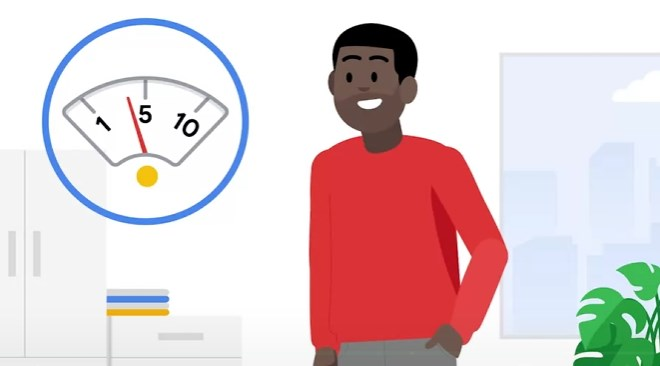
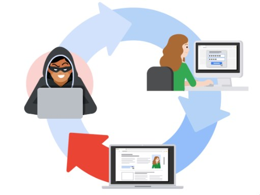

# Vulnerability 

For every assets that needs protecting there are a dozen vulnerabilities.

Vulnarability management is finding and patching vulnerabilities. It is a 4 part cycle
1. Identify
2. Consider potential exploit
3. Prepare defenses
4. Evaluate the defenses

Defense in depth. This concept represents the multiple layers an attacker must penetrate through inorder to get to the sensitve inside.

The following layers are the following:
1. The perimeter layer : This is authentification layer such as password
2. Network layer : The firewall relating to authorization
3. Endpoint layer : Antivirus software
4. Application layer : defense encoded in the application (such as MFA)
5. Data layer : Finally the data this is things such as encrpytion

And more.

## Common Vulnerabilities and Exposures (CVE)
Communities work together to ensure security by exposing vulnerabilities in the wild these are called CVE. A CVE list is a dictionary of common vulnerabilities and exposures. A CVE numbering authority verifies the authenticity of the vulnerability also called CNA.

The criteria of a vulnerability is the following:
1. Independant of other issues i.e., does not rely on another unpatched vulnerability
2. Recognized as a potential security risk
3. Submitted with evidence
4. Report only affects a single codebase

CVSS is the NIST convention to score CVE (CVE Scoring System)

## Open Web Application Security Project (OWASP)
OWASP is a non-profit organization where security inclined folks share information and vulnerabilities on web technologies.

The following are some caterogories which appear on the OWASP Top 10 common web vulnerabilities:

1. Broken Access Control. Relates to control to what a user can do. i.e., a user may post but cannot remove this can result in accidental sensitive data not being able to be removed.
2. Cryptographic Failures. Such as use of a outdated crptographic algorithm, or none at all.
3. Insecure Deisgn. Design makes them more suscetible to attack such as no seperation of concerns, layer in depth or least priveledges.
4. Security misconfiguration. Network configured incorrectly
5. Bulnerable Outdated Components. Third party software not being updated or removed
6. Idnetification /Authentification failures. Application failes to recognize or authenticate the person sking for access
7. Software and data integrity failures.  Patches not reviewed or tested before relaeasing.
8. Server side request foregery. Some companies have information stored in the browser either through cookies session, a SSRF utilizes this by sending a malicious link that piggy backs on the stored information

## Vulnerability Assessment
How they are found. This is an internal review process of a organisations systems. It may utilizes the CVE list to identify weakpoints.

Identification (scanning tools) > Analysis (test and find source) > Risk assessment (How severe is it x What is the likly hood) > Remediation (report it to the software developers to fix)

Organisations that are regulated by PCI DSS, HIIPA and GDPR must routinely perform penetration tests.

[Bug Bounty Program](https://hackerone.com/bug-bounty-programs)

### Lab Analyze a vulnerable system
The database server contains company sensitive information. Leaking this information is detrimental to the companies growth as it may give competetors an edge, be a impetus for attackers and damage the companies reputation.

Threat sources:
1. Outsider, competitor or standard user. Anyone that has knowledge of the public server may target it for an attack. Being public this can be targetted by anyone
2. Technological: Any technologicla vulnerabilities will be exploitable

The following are potential threats events by having a public server:
1. Alter/Delete critical information
2. Conduct denial of service attacks
3. Obtain sensitive information via exfiltraion

The following remdiation are suggested:
1. Take the server down from the public domain and alternativly establish a VPN service for internal employees to access the resources

## Cyber attacker mindset

What is the attack surface, what are all the potential vulnerabilities that can be vulnerable.

1. Identify target
2. Determine how it can be asseed
3. Attack vector avaialble
4. How to utilize the tools to penetrate

The following are tools which attacker may use to break into software/servers via brute force
- Aircrack-ng, Hashcat, John the riiper, Ophcrack and THC hydra