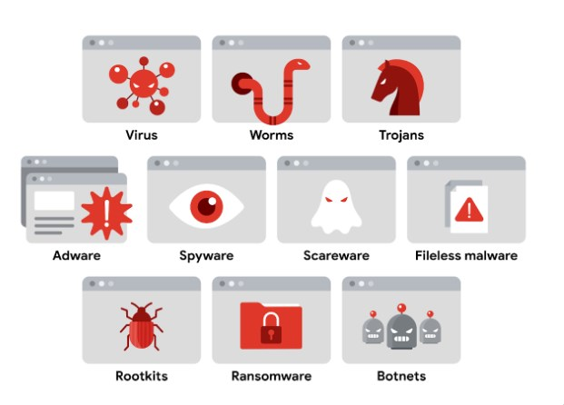
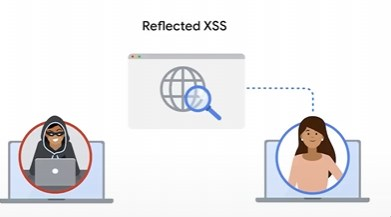
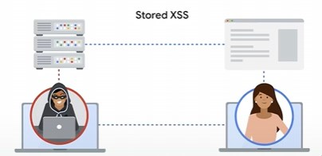
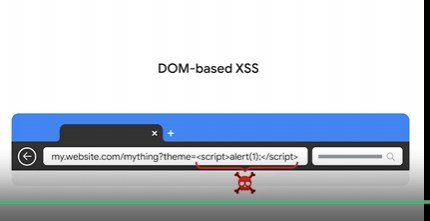
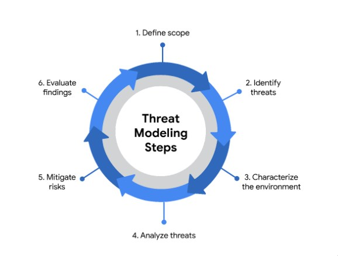
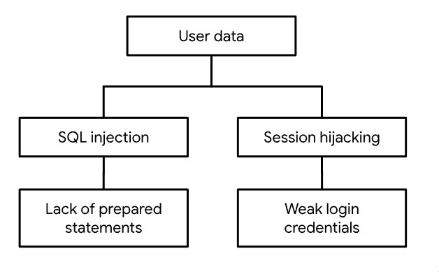

# Threats to Asset Security

Often the most exploitable part of an organization is the people. Unfortunately people are prone to many mistakes and may leak information of be a target of a social engineering attack. One form is phising

As technology advancing so has phising nowadays what we use to "verify" a legitamate user may not be sufficient as there is ai voice generation, information leaks etc., that can be used as "proof". The bottom line is that do not give information away.

Take the google quiz to show what sophistication is involve din phising

[Google phish quiz](https://phishingquiz.withgoogle.com/)

## Malicous Software

Malware comes in all kinds of shapes and sizes

cryptojacking

### XSS 
Cross site scipting is embedding malcious code in a web application.
There are three main types of XSS attacks:
1. Reflected XSS the criminal sends a link that appears to go a trusted site, however the vulnerable server actually serves the target the criminals custom malware in the HTML/Javascript

2. Stored XSS. The Stored XSS sin't hidden in a link that is send by a server, instead the script is injected directoly on the server. This can be things such as images or button, elements that are served.

3. DOM based XSS. The malcious script is navigated to by dom based elements such as query in the URL or hidden in javascript in the html tags
   

### SQL Injections
SQL Injections vulnarabilities happen when we trust the user input.

There are three SQL inection caterogies:
1. Inband : Uses the same communication channel to launch attacks and gather info
2. Out of band : Attacker creates a connection between vvln website and database they control
3. Inferential : The SQL injection occurs but the results are not visible however the behaviour of the website changes.

## Threat modeling

PASTA the Process of Attack Simulation and Threat Analysis. This is a standard threat modelling process. But there are others such as STRIDE and VAST

What are we working on?

What kinds of things can go wrong?

What are we doing about it?

Have we addressed everything?

Did we do a good job?

Sample attack tree

A proper analysis of the application using PASTA