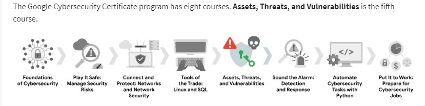
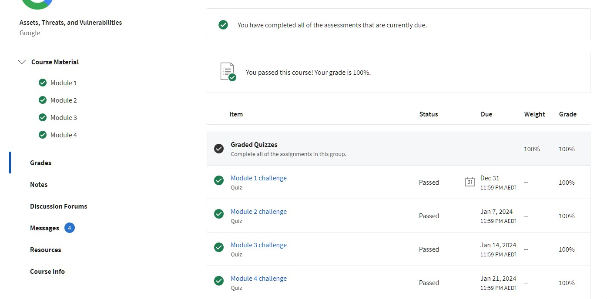

# Assets, Threats and Vulnerabilities

The wide world of security.

Assets should be accounted for an unaccounted asset is a vulnerability

The following are assets
- Digitial assets : Financial records, login data, PII
- Intelectual property
- Physical assets etc

