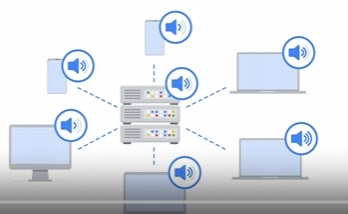

# Incidents And Networking Traffic

Data: Tuesday 9AM
Description: Employees loss access to their computers and software required to perform everyday function. Randsomware screen on some PCs asking for a large sum of money for the decryption key
Tools Used: The attackers gained entry using phishing and in those meials was a malicious attachment.

log4j vulnerability.

CSIRT = Computer Security Incident Response Team. Is a team of highly trained professionals ready for incident response.

Threat hunter and Forensic analysist. The former find vulnerabilities and threats, whilst the later estracts and stores data.

## IDS and IPS
Are technologies to detect and prevent intrusions. An EDR(Endpoint Detection and Response) goes a step beyond and preforms behavioural analysis. IDS do not play an active role in preventing.

Alerts are sent to the SIEM tools. SIEM tools aggregate data from all kinds of sources such as proxy server, firewalls, ips, ids, edr and more then provides accesibility and analystics
- Collect/Aggregate
- Normalize : Format all the event data into a consistant standard format
  
- Analayze

SOAR on the other hand is a collection of application, tools and workflows to automatically respond to security events

Security Ochestration Automation and Response

## Network Traffic

Network communication travels all over the place. By carefully observing the traffic and having an idea of what is "normal" this enables us to detect the abnormal. Such charatertistics are
- Baseline traffic level (how much bandwidth is being used)
- Flow analysis (what packets, protocols and ports are being engaged)
- Packet information nalaysis (ip address source destination)
- Temporal pattterns (when does the traffic change)

Components of the Ipv4 Headers:
- Version : which version of Ip is being used
- IHL : Internet header length = length of header and options
- TOS : should this packet be trated with care
- Total Length : Headers and data
- Identification, flags and fragment : Deals with fragmentation and reassembly
- TTL time to live : how long will a packet live before dieing
- Protocol : Protocol used for this packet (TCP = 6 )
- Header checksum : ensures that no errors have occured in the header
- Source and Destination address (IpAddress)
- Options : Additional information

Ipv6 

Ipv6 has fewer fields in the header. Notably the diffrent ones
- Traffic class: Similar to ToS in ipv4
- Flow label : field indicates packets of a flow, is the sequence of packets sent from a specific source
- Next header : this file dindicates the type of header that follows the Ipv6 header such as TCP

### Wireshark for packet nalaysis
Wireshark you can apply filters on the captures traffic i.e., using
1. Comparison operators such as ip.src == 8.8.8.8 or ip.src < 192.168.0.1
2. `contains` checks for all packets whos infor contains a string
3. Filter by protocol i.e., http or dns (fty, ssh, arp, telnet ..)

## TCPdump
Tcpdump is a command line network protocol analyzer. The traffic is saved to a packet capture file (p-cap)

`sudo tcpdump [-i interface] [option(s)] [expression(s)]`

there are alot of options however the most common one is `-i any -c #packets` 
whichi captures #packets on any interface. The -w flag can be used to write to a file after capturing. -r can be used to read a pcap file.

Exprssions can be used to filter traffic such as `sudo tcpdump -r packetcapture.pcap -n 'ip and port 80'` in this case -n is simply a flag to do name resulution the exprssion is 'ip and port 80'

The following is a lab analyzing network traffic

Some checksums are actually flagging as incorrect!

`-nn` is best practice as trying to resolve names may alert bad actors onto an investigation

`sudo tcpdump -D` is used to identify avaialble interfaces to capture

### Differences in wireshark and tcpdump
Wireshark is a GUI (also has CLI option) tcpdump is strictly CLI
Wireshark enables you to delve deeper into a packet with alot of diffrent protocols (advanced filtering)
WS irrquires more resources

They are very similar they have : filterning, monitoring and also indepth analysis