# Investigate incidents
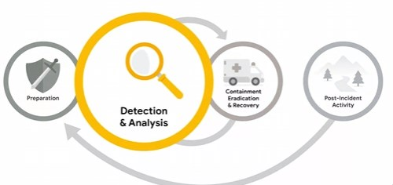

Verify and analyse the events

The pyrimid of pain reprsents how much pain an attcker needs to go through in order to bypass 
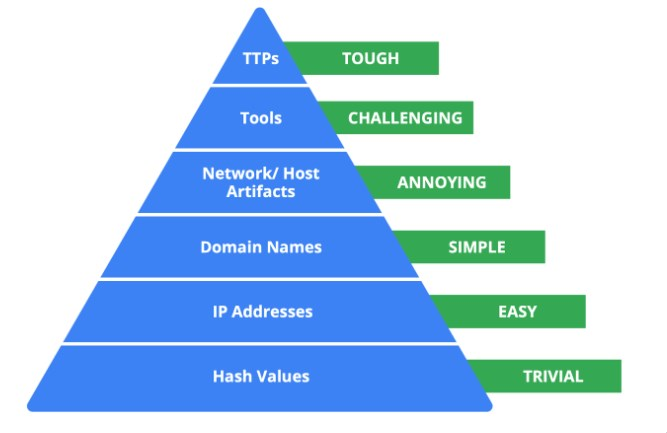

Hash values: Hashes that correspond to known malicious files. These are often used to provide unique references to specific samples of malware or to files involved in an intrusion.

IP addresses: An internet protocol address like 192.168.1.1

Domain names: A web address such as www.google.com 

Network artifacts: Observable evidence created by malicious actors on a network. For example, information found in network protocols such as User-Agent strings. 

Host artifacts: Observable evidence created by malicious actors on a host. A host is any device that’s connected on a network. For example, the name of a file created by malware.

Tools: Software that’s used by a malicious actor to achieve their goal. For example, attackers can use password cracking tools like John the Ripper to perform password attacks to gain access into an account.

Tactics, techniques, and procedures (TTPs): This is the behavior of a malicious actor. Tactics refer to the high-level overview of the behavior. Techniques provide detailed descriptions of the behavior relating to the tactic. Procedures are highly detailed descriptions of the technique. TTPs are the hardest to detect. 

Virus Total is a crowdsourcing site to aggregate security results. Anyone can scan a file and if comprimise is found it will be released.

**We may not open a file but we can create a hash of that file to analyze in virus total.**

We can use linux to generate a hash from a file

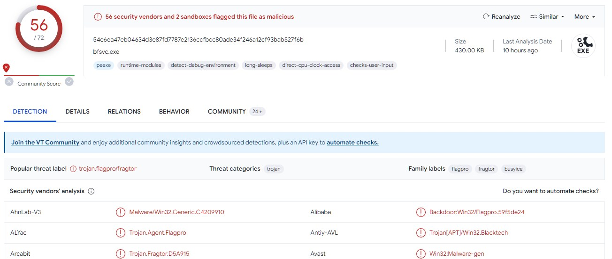
- Vender radio is the number of flagged vendors vs non flagged vendors
- The communitory score is based on collective inputs of VT community. The more negative the more likely to be malicious.

## Documentation
Documentation is important to disseminate information.
- Transparency : Chain of Custody
- Standaization : Repitable/standsrds
- Clarity : Quickly understandable, clear
  
Are the following benifits of documentation

Playbook with a flowchart

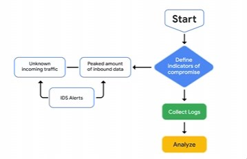

## Response and Recovery

Triages : What is it? True positive > What is the risk/serverity? How to responsd.

Containment and eradication

Post incident response is lessons learnd
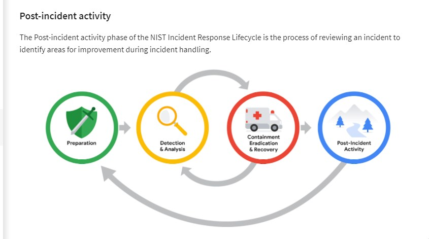

- Executive summary, Timeline, investigation and recocomentdations

## IDS and SIEM/Logs

Logs provide the events of occurances.

One of the most commonly used log form is the **Syslog**

The sys log contains the header, structured data and the message
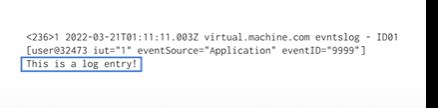

Telemtry is the transmission and collection for data analysis. i.e., Packet capture is called network telemetry.

Types of intrusion detection 
- Host means on the endpoint and analysis suspcious files or activity done
  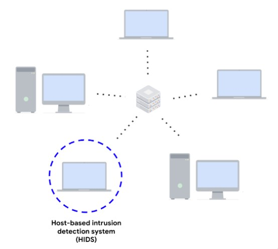
- Network analysis the packet movement similar to packet analaysis

Some techiniques to detec threas are:
- Signature based analysis i.e.,e find a pattern that is associenty with malicous activity such as repittive log in attempts or unusal IP address; It has a low rate of false positives, however can easily be bypassed
- Anomly based techniques 
  - Has a learning phase to understand the baseline activity and network activity
  - Has a detection pahse
  - Has a higher rate of fasle postivies however can detect new or evolving threats

Analysising NIDS = action header and rules
The rules define what actions to take when the header/signatures is met
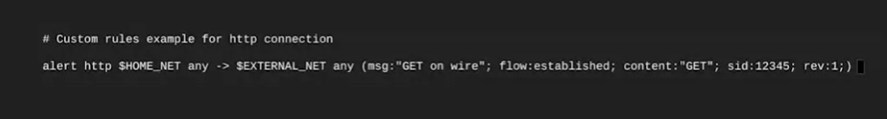

[Suricata](https://suricata.io/) generates alert logs and network telemerty logs uses EVE JSON

More suracata rules/signatures (they are synonomous)
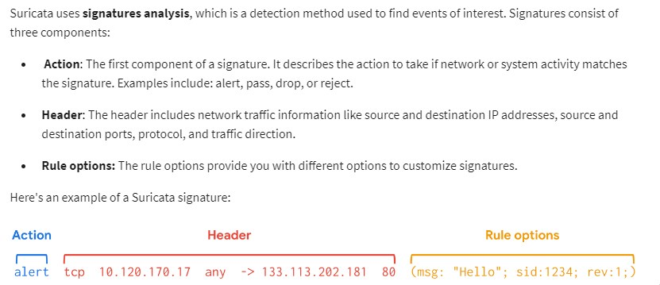

Types of actions:
- alert (mathcing traffic will alert the user)
- drop (matching traffic will be dropped)
- pass (used to override other ruels)
- reject

Rule order affects the final verdict of a packet

This lab we analyze some data in suracata

`jq` command is very usefull for formating jason data

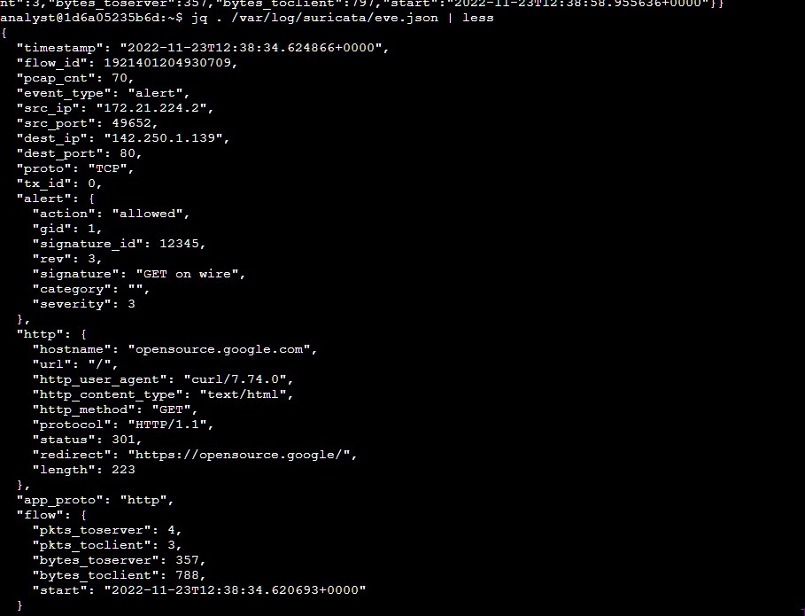

Then using it to analyze specific parts of the outputby id
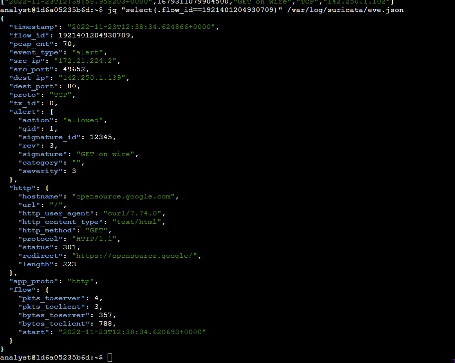

## SIEMS (again!)
Log forwarderes send data to the SIEM to injest. These are software solutions

Chronicle and YARL-L UDM search (Unified Data Model)

There was alot of journal updates and incident handling activities in this one