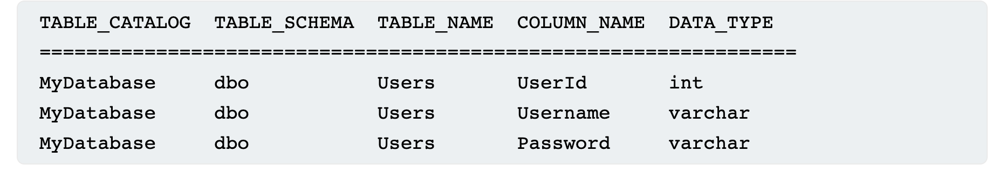

# SQL Injections

Most SQL Injections occur in the SELECT clause hoever we can also expand to other attacks such as the SQL [Union](https://www.w3schools.com/sql/sql_union.asp) attacks.
Union attacks are quite restrictive since they require
- The two queries return the same number of columns
- Data types between queries must be compatible

Since Union appends the results from the first query with the results of the second query (by column)

To find the number of columns we can utilizes the ORDER BY sent in a where clause i.e.,

```
' ORDER BY 1--
' ORDER BY 2--
' ORDER BY 3--
etc.
```
[Using Unions and Null values](https://portswigger.net/web-security/learning-paths/sql-injection/sql-injection-determining-the-number-of-columns-required/sql-injection/union-attacks/determining-the-number-of-columns-required-6r5t)

Or using union select and a number of null values. Since NULL is compatible with every common data type, and we must have all values returns by the injected select to be compatible with. If successfull the result returns an additional row with all NULL values in the columns, however is succestuble to NULL POINTER EXCEPTION

```
UNION SELECT NULL [,NULL]--
```


In this lab we discover the number of columns in a SQL query notice after trying three NULLs there is an extra row of NULLS at the bottom!

## [Database specific queries](https://portswigger.net/web-security/sql-injection/cheat-sheet)
Oracle requires the use of the FROM after a SELECT call. We may use DUAL which is a default table always available

On mySQL the comment commnad `--` should always be followed by a SPACE


## Looking for string data

String data usually is what we want to exfiltrate from the website, hence looking for a column that is compatible with string data comes in handy the typical way is to submit SQL UNION statements with a string character i.e.,`'a'` and check that the website response.

E.g. ' UNION SELECT 'a',NULL,NULL,NULL -- 


In this lab we send the SQL query when looking for accesories


> Database names and columns are difficult to find. Sometimes we need to guess however, all moderns Databases have a function to examine the tables and columns, if only we can access that functionality... 


### Lab Usefull data
In this lab we have discovered a SQL vulnerability in the filtering of the website. Now hypothetically assume there is a table called users with a username and password column.. ah now we can use a modified query to extract this data

```
UNION SELECT username,password FROM users --
```

lab solved


> Internal Server Error : Indicators of SQL server processing command and giving response

## Combining columns in SQL from the database

In ORACLE we can use the double pipe to concatonate columns

```
' UNION SELECT username || '~' || password FROM users--
```

In this case we join the fields with a '~'. Concatonation may be diffrent depending on the database


## Gather the information about the DATABASE!
Information gathering is the most important step of trying to break in!
- What type and version of database are they running
- What tables and columns do they contain

This can be done by doing these queries:

```
Database type	    Query
Microsoft, MySQL	SELECT @@version
Oracle	            SELECT * FROM v$version
PostgreSQL	        SELECT version()
```

To aqcuire the table and columns we can attempt to use information schemas. i.e.,

 `SELECT * FROM information_schema.tables`

 

and further more we can query the columns using 

`SELECT * FROM information_schema.columns WHERE table_name = 'Users'`



## [Lab SQL Injection Examining Database](https://portswigger.net/web-security/learning-paths/sql-injection/sql-injection-examining-the-database-in-sql-injection-attacks/sql-injection/examining-the-database/lab-listing-database-contents-non-oracle#) 

First we try this query on the known SQLi vulnerable filter 
> Food & Drink ' UNION SELECT table_name,NULL FROM information_schema.tables --


We get alot of tables but looking through the [html](./lab_examining_db/labTB_return1.html)
two tables stick out sticks out from the query results
- pg_user
- pg_auth_members

Lets check the user table with the next query

> Accessories ' UNION SELECT column_name,NULL FROM information_schema.columns WHERE table_name = 'pg_user' -- 

And we get these columns aha!


Lets finally check what the column consist of by doing a union on usename and passwd

Hmm the passwords are not in cleartext infact they are just ****** symbols?

Dead end!

